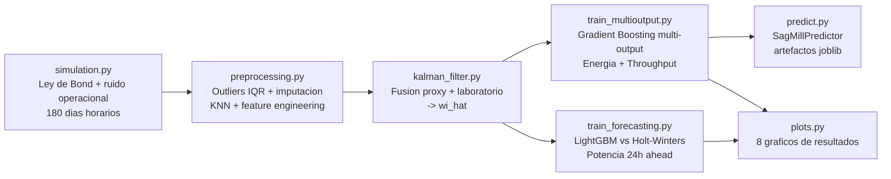
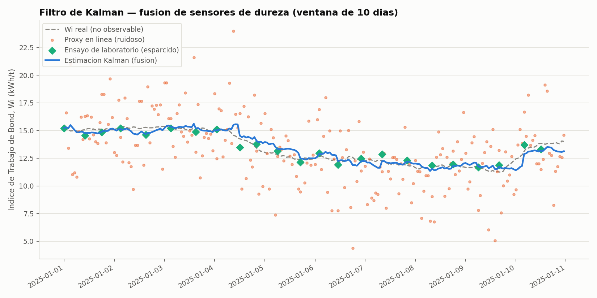
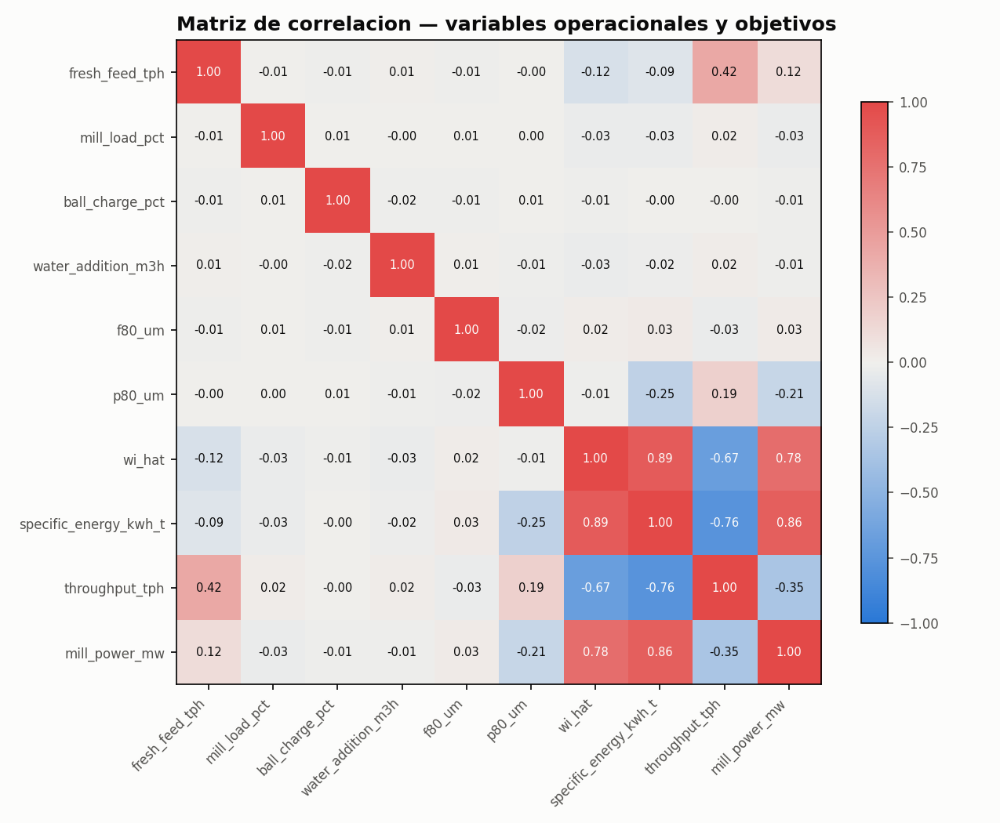
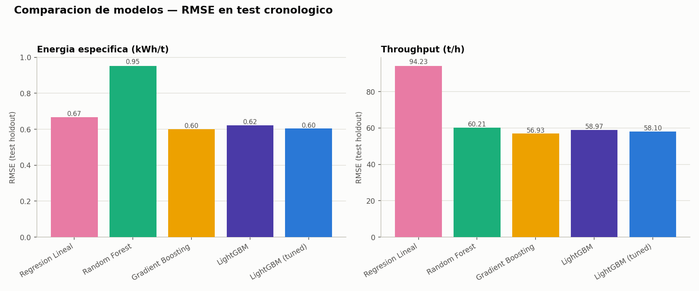
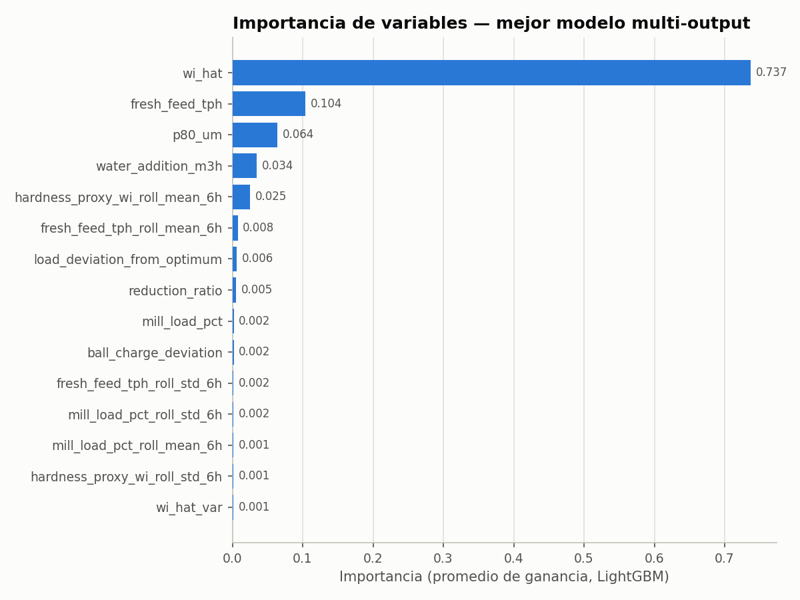
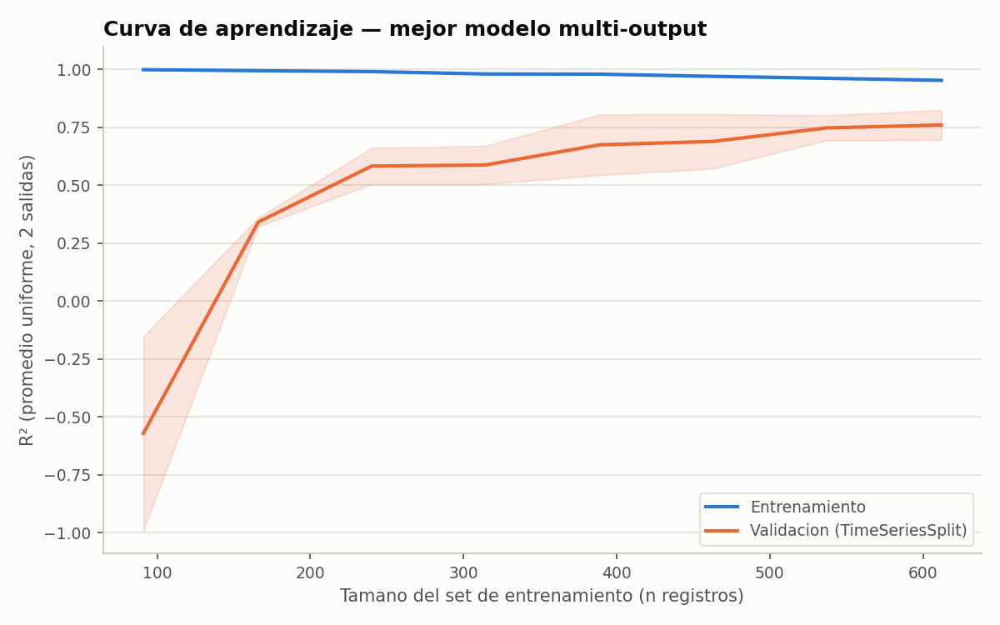
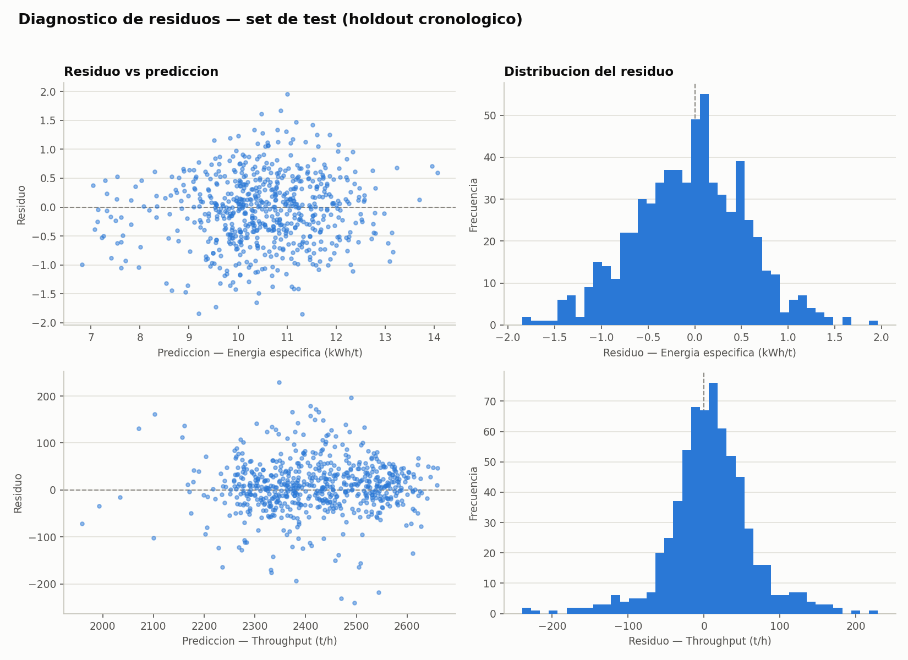
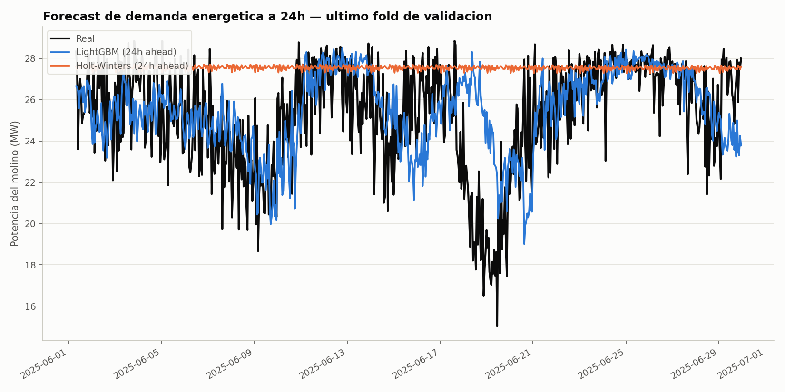
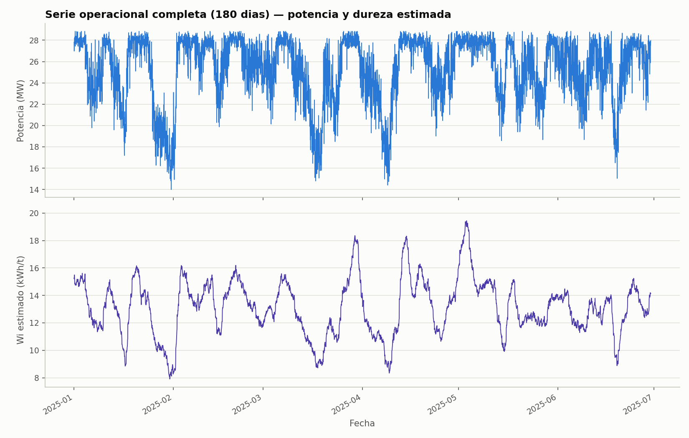

[ 🇬🇧 Read in English ](README.md) | [ 🇨🇱 Español ]

# 1. Título del Proyecto

## Gemelo Digital Predictivo de Eficiencia Energética para Molienda SAG en Minería del Cobre


Un gemelo digital que fusiona sensores ruidosos de dureza de mineral con un
**Filtro de Kalman**, predice **energía específica y throughput de un
molino SAG de forma conjunta** con **Gradient Boosting multi-output**, y
anticipa la **demanda energética a 24 horas** comparando un baseline
estadístico clásico (Holt-Winters) contra un enfoque de Machine Learning —
todo entrenado, evaluado y graficado por un único comando (`run_pipeline.py`),
sin intervención manual.

---

# 2. Motivación

La conminución (chancado + molienda) es, de forma consistente, **la etapa
de mayor consumo energético en una planta concentradora de cobre** —
comúnmente citada en la literatura de procesamiento de minerales como el
30-50% del consumo eléctrico total de una faena. Chile concentra
aproximadamente una cuarta parte de la producción mundial de cobre mina, y
buena parte de esa producción proviene de yacimientos porfídicos ubicados
en zonas desérticas de altura, con costos de energía estructuralmente altos
y sistemas de transmisión largos hacia el Sistema Eléctrico Nacional (SEN).

El problema operacional concreto es este: el **Índice de Trabajo de Bond
(Wi)** del mineral que entra al molino —la variable que más determina cuánta
energía se necesita para moler— **no se mide en línea**. Cambia con cada
bloque o fase de mina, y el operador solo cuenta con proxies indirectos y
ruidosos (potencia, vibración) más un ensayo de laboratorio que llega horas
después. El resultado típico es un molino que opera reactivamente respecto
a su propia capacidad instalada, en vez de anticiparse.

**Impacto económico ilustrativo** (calculado con los propios números que
este proyecto produce al ejecutarse, no una cifra de folleto): la
simulación de referencia de este repositorio arroja una potencia promedio
de **25.3 MW** sobre un molino de 28 MW instalados. A un costo industrial
de referencia de ~USD 70/MWh (rango típico citado para contratos de
suministro a gran minería en Chile), eso implica un gasto energético anual
del orden de **USD 15.5 millones para una sola línea SAG**. Una mejora de
apenas **1% en eficiencia energética específica** —el tipo de ganancia que
un soft-sensor y un modelo de setpoint predictivo pueden capturar—
equivaldría a unos **USD 155.000/año por línea**; una operación grande con
varias líneas SAG multiplica esa cifra en consecuencia. Esta cuenta es
deliberadamente ilustrativa (no es el ROI de ninguna faena específica); el
punto es que en conminución, fracciones de punto porcentual de eficiencia
energética son dinero real, no un decimal cosmético.

---

# 3. Marco Teórico

### 3.1 Tercera Ley de Bond de la conminución

La energía específica de molienda se modela con la **Tercera Ley de Bond**
(Bond, 1952), el estándar de la industria para estimar de primer orden la
energía requerida en reducción de tamaño:

```
W = 10 · Wi · ( 1/√P80 − 1/√F80 )
```

donde `W` es la energía específica (kWh/t), `Wi` es el Índice de Trabajo de
Bond del mineral (kWh/t, un proxy de dureza obtenido en laboratorio), y
`F80`/`P80` son los tamaños de partícula (µm) que pasan el 80% en
alimentación y producto respectivamente. Este proyecto usa `P80 = 150 µm`
—el tamaño típico de alimentación a flotación en cobre porfídico, y el
mismo rango (~100-150 µm) que define el propio ensayo de laboratorio del
Índice de Trabajo de Bond— por lo que la ecuación se aplica de forma
consistente con su definición original.

Sobre la energía ideal de Bond se superpone un **factor de ineficiencia
operacional** (curva en U respecto al % de llenado óptimo, la carga de
bolas y el agua de proceso): alejarse de la operación óptima siempre
incrementa el consumo específico, nunca lo reduce. Esta no-linealidad es
intencional: es la parte de la señal que la Ley de Bond por sí sola no
explica, y que un modelo de Machine Learning sí puede aprender a partir de
datos operacionales.

### 3.2 Filtro de Kalman (estimación de estado, soft-sensor)

El Wi real es un **estado oculto** que solo se observa de forma indirecta.
Modelamos su evolución como una caminata aleatoria:

```
Estado:       x_t = x_{t-1} + w_t,        w_t ~ N(0, Q)
Observación 1: z_proxy_t = x_t + v1_t,     v1_t ~ N(0, R_proxy)   (cada hora)
Observación 2: z_lab_t   = x_t + v2_t,     v2_t ~ N(0, R_lab)     (cada 8-12h)
```

El Filtro de Kalman es el **estimador lineal de mínima varianza** para este
tipo de sistema (óptimo bajo ruido gaussiano, teorema de Kalman-Bucy). En
cada paso se aplican predicción (`x_pred = x_{t-1}`, `P_pred = P_{t-1} + Q`)
y actualización secuencial por cada sensor disponible, ponderando cada
observación por la ganancia de Kalman `K = P_pred / (P_pred + R)`: cuanto
más ruidosa la fuente, menor su peso relativo en la fusión. `Q`, `R_proxy` y
`R_lab` no se fijan a mano: se **estiman empíricamente** a partir de la
volatilidad de alta frecuencia de cada serie (ver `HardnessKalmanFilter.from_data`).

### 3.3 Gradient Boosting multi-output

`specific_energy_kwh_t` y `throughput_tph` están **acoplados físicamente**
(`Potencia ≈ Energía_específica × Throughput`, a potencia instalada
aproximadamente fija): predecirlos con un solo modelo multi-output captura
esa covarianza, en vez de tratarlos como dos problemas independientes. El
Gradient Boosting de scikit-learn y LightGBM no soportan multi-output
nativo (a diferencia de Random Forest o la regresión lineal), por lo que se
envuelven en `sklearn.multioutput.MultiOutputRegressor`, que entrena un
estimador por salida pero comparte el mismo conjunto de features de
entrada. Cada árbol de boosting se ajusta secuencialmente al gradiente
negativo de la función de pérdida (residuos) del árbol anterior.

### 3.4 Forecasting de series de tiempo (24h ahead)

Se compara un baseline estadístico clásico —**Holt-Winters** (suavizamiento
exponencial triple: nivel + tendencia + estacionalidad aditiva, periodo 24)—
contra LightGBM sobre features de rezago y ventanas móviles. La validación
usa siempre **TimeSeriesSplit / walk-forward**, nunca K-Fold aleatorio: con
series de tiempo autocorrelacionadas y features de rolling-window, un fold
aleatorio filtraría información del futuro hacia el pasado, inflando
artificialmente el desempeño reportado.

---

# 4. Explicación

## Arquitectura del pipeline



Cada etapa es un módulo independiente en `src/`, con su propio `if __name__
== "__main__"` para poder ejecutarse y depurarse de forma aislada, y
`run_pipeline.py` en la raíz orquesta las seis etapas de punta a punta con
un solo comando, guardando cada artefacto intermedio (`data/processed/`,
`outputs/models/`, `outputs/reports/`, `outputs/plots/`) para inspección o
reuso.

## Descripción de los módulos

| Módulo | Responsabilidad |
|---|---|
| [`src/data/simulation.py`](src/data/simulation.py) | Simulador horario del molino SAG fundado en la Ley de Bond, con régimen de dureza por bloques, ineficiencia operacional en U y dropout de sensores. |
| [`src/features/preprocessing.py`](src/features/preprocessing.py) | Recorte de outliers (IQR robusto), imputación (forward-fill + KNNImputer) y feature engineering (ratios, rolling stats, variables cíclicas). |
| [`src/features/kalman_filter.py`](src/features/kalman_filter.py) | Filtro de Kalman escalar con estimación empírica de Q/R y fusión secuencial de dos sensores. |
| [`src/models/train_multioutput.py`](src/models/train_multioutput.py) | Compara 5 modelos multi-output, ajusta hiperparámetros de LightGBM (`RandomizedSearchCV` + `TimeSeriesSplit`), serializa el mejor modelo. |
| [`src/models/train_forecasting.py`](src/models/train_forecasting.py) | Dataset supervisado de forecasting a 24h, comparación walk-forward LightGBM vs. Holt-Winters. |
| [`src/inference/predict.py`](src/inference/predict.py) | `SagMillPredictor`: replica el pipeline de features exacto de entrenamiento sobre datos crudos nuevos y sirve predicciones. |
| [`src/visualization/plots.py`](src/visualization/plots.py) | Genera los 8 gráficos de resultados (EDA + diagnóstico de modelos) con paleta validada para accesibilidad. |
| [`run_pipeline.py`](run_pipeline.py) | Orquestador end-to-end de las 6 etapas anteriores. |

---

# 5. Metodología

- **Validación cronológica, nunca aleatoria.** El holdout final de test es
  el último 15% de la serie temporal (nunca mezclado con entrenamiento), y
  toda validación cruzada usa `TimeSeriesSplit` (5 folds, walk-forward) en
  vez de K-Fold estratificado — con features de rolling-window, un fold
  aleatorio filtraría información futura hacia atrás.
- **Outliers**: recorte robusto por rango intercuartílico (factor 3.0, no
  el clásico 1.5) sobre las variables objetivo y de potencia, para no
  recortar variación operacional legítima en un proceso intrínsecamente
  ruidoso.
- **Imputación**: forward-fill para caídas de sensor cortas (≤2h) y
  `KNNImputer` (5 vecinos, sobre variables operacionales correlacionadas)
  para el resto.
- **Optimización de hiperparámetros**: `RandomizedSearchCV` (20
  iteraciones) sobre LightGBM — `num_leaves`, `max_depth`, `learning_rate`,
  `n_estimators`, `min_child_samples`, `subsample`, `colsample_bytree` — con
  `cv=TimeSeriesSplit(5)` y `scoring="r2"`.
- **Métricas de evaluación**: RMSE, MAE y R² por salida para el modelo
  multi-output; RMSE, MAE y MAPE (%) para el forecasting, promediados sobre
  los folds walk-forward con su desviación estándar.
- **Selección de modelo**: el mejor modelo se elige por R² uniforme
  promedio sobre ambas salidas en el holdout de test, no por CV interna,
  para reportar desempeño sobre datos genuinamente no vistos.

---

# 6. Desarrollo

Código modular en Python, sin notebooks: cada etapa (ingesta →
procesamiento → entrenamiento → predicción → serialización) vive en su
propio módulo testeado (`tests/`, 22 tests con `pytest`), y los artefactos
del mejor modelo se serializan con `joblib` (`outputs/models/*.joblib`)
junto a la lista exacta de columnas de features, para que la inferencia en
producción (`SagMillPredictor`) nunca dependa de recordar el orden o
nombre de las columnas de entrenamiento.

## Instalación y ejecución

```powershell
git clone https://github.com/Rxyxs/chile-mining-sag-energy-digital-twin.git
cd chile-mining-sag-energy-digital-twin
python -m venv .venv
.venv\Scripts\activate
pip install -r requirements.txt
```

### Pipeline completo (un solo comando)

```powershell
python run_pipeline.py
```

Simula 4,320 registros horarios (180 días), preprocesa, corre el Filtro de
Kalman, entrena y compara los 5 modelos multi-output (con búsqueda de
hiperparámetros), entrena y compara el forecasting, y genera los 8 gráficos
de resultados — todo en una sola corrida.

### Etapas individuales (para depuración)

```powershell
python -m src.data.simulation
python -m src.features.preprocessing
python -m src.features.kalman_filter
python -m src.models.train_multioutput
python -m src.models.train_forecasting
python -m src.visualization.plots
```

### Inferencia sobre datos nuevos

```powershell
python -m src.inference.predict data/raw/sag_mill_operation_raw.parquet --output predicciones.csv
```

### Tests

```powershell
pytest
```

## Estructura

```
chile-mining-sag-energy-digital-twin/
├── data/
│   ├── raw/                       # crudo simulado (parquet, generado)
│   └── processed/                 # limpio + features + Kalman (generado)
├── outputs/
│   ├── models/                    # mejor modelo + columnas (joblib, generado)
│   ├── reports/                   # métricas, comparaciones, residuos (json/csv, generado)
│   └── plots/                     # 8 gráficos de resultados (png, versionados)
├── src/
│   ├── data/simulation.py
│   ├── features/{preprocessing,kalman_filter}.py
│   ├── models/{train_multioutput,train_forecasting}.py
│   ├── inference/predict.py
│   └── visualization/plots.py
├── tests/                         # 22 tests, pytest
├── run_pipeline.py                # orquestador end-to-end
└── requirements.txt
```

---

# 7. Resultados

Todos los números y gráficos de esta sección provienen de una corrida real
de `run_pipeline.py` (seed 42, 4,320 registros horarios = 180 días,
holdout cronológico de 648 registros = 15%).

## 7.1 Filtro de Kalman — fusión de sensores de dureza

| Fuente | RMSE vs. Wi real |
|---|---|
| Proxy crudo en línea (sin filtrar) | 2.601 kWh/t |
| **Estimación Kalman (fusión proxy + laboratorio)** | **0.545 kWh/t** |
| **Reducción de error** | **79.0%** |



## 7.2 Análisis exploratorio — correlaciones



La estimación Kalman (`wi_hat`) correlaciona 0.89 con la energía específica
real y −0.67 con el throughput — consistente con la física de Bond: mineral
más duro exige más energía por tonelada y, a potencia limitada, obliga a
bajar el throughput. `fresh_feed_tph` y `throughput_tph` correlacionan 0.42
(no 1.0): la diferencia es exactamente el régimen en que la potencia
instalada, no el setpoint del alimentador, es la restricción activa.

## 7.3 Modelo multi-output — comparación de modelos

**Energía específica (kWh/t)**

| Modelo | RMSE | MAE | R² |
|---|---|---|---|
| Regresión Lineal | 0.666 | 0.541 | 0.755 |
| Random Forest | 0.953 | 0.752 | 0.499 |
| **Gradient Boosting** | **0.600** | **0.474** | **0.801** |
| LightGBM | 0.622 | 0.489 | 0.787 |
| LightGBM (tuned) | 0.604 | 0.477 | 0.799 |

**Throughput (t/h)**

| Modelo | RMSE | MAE | R² |
|---|---|---|---|
| Regresión Lineal | 94.23 | 74.53 | 0.467 |
| Random Forest | 60.21 | 46.15 | 0.783 |
| **Gradient Boosting** | **56.93** | **40.68** | **0.806** |
| LightGBM | 58.97 | 44.29 | 0.791 |
| LightGBM (tuned) | 58.10 | 43.31 | 0.797 |

**Gradient Boosting (sin ajustar) fue el mejor modelo** (R² uniforme
promedio = 0.803 sobre ambas salidas) — superó incluso a LightGBM con
búsqueda de hiperparámetros, un resultado empírico, no asumido de
antemano.



## 7.4 Importancia de variables (mejor modelo)

| # | Variable | Importancia |
|---|---|---|
| 1 | `wi_hat` (estimación Kalman de dureza) | 0.737 |
| 2 | `fresh_feed_tph` | 0.104 |
| 3 | `p80_um` | 0.064 |
| 4 | `water_addition_m3h` | 0.034 |
| 5 | `hardness_proxy_wi_roll_mean_6h` | 0.025 |



La variable más importante del modelo predictivo **es exactamente la que
produce el Filtro de Kalman**: el soft-sensor no es un ejercicio académico
aislado, es la señal que más explica el consumo energético del molino.

## 7.5 Curva de aprendizaje y residuos



La curva de validación se estabiliza cerca de R² ≈ 0.78-0.79 desde ~500
registros de entrenamiento en adelante, con una brecha moderada respecto al
entrenamiento (R² ≈ 0.96-1.00) — indicio de varianza controlada, no de
sobreajuste severo.



Los residuos de ambas salidas se distribuyen simétricamente alrededor de
cero sin patrón sistemático evidente respecto a la predicción
(homocedasticidad razonable).

## 7.6 Forecasting de demanda energética (24h ahead)

| Modelo | RMSE (MW) | MAE (MW) | MAPE (%) |
|---|---|---|---|
| Holt-Winters (baseline clásico) | 3.822 | 3.035 | 12.97% |
| **LightGBM (lags + rolling)** | **2.767** | **2.097** | **8.62%** |

LightGBM reduce el RMSE en **27.6%** y el MAPE en **33.5%** respecto al
baseline estadístico clásico — el historial reciente (lags) capta
transiciones de régimen de dureza que un modelo puramente estacional no
puede anticipar.





---

# 8. Conclusión

- **El Filtro de Kalman funciona y se demuestra que importa**: reduce el
  error de estimación de dureza en 79% frente al proxy crudo, y la
  variable resultante (`wi_hat`) termina siendo, por un margen amplio, la
  más importante del modelo predictivo (73.7% de la ganancia total). Esto
  valida la inversión en un soft-sensor de dureza como algo con retorno
  medible, no un componente decorativo.
- **El acoplamiento físico entre energía y throughput es real y
  aprendible**: un modelo multi-output alcanza R² ≈ 0.80 en ambas salidas
  simultáneamente, y el ganador (Gradient Boosting sin ajustar) superó
  incluso a la versión de LightGBM con búsqueda de hiperparámetros — un
  recordatorio de que más complejidad no siempre gana, y de que hay que
  medir en vez de asumir.
- **El forecasting basado en Machine Learning supera al baseline
  estadístico clásico en 27.6%** para anticipar la demanda energética a 24
  horas, con un margen que se explica por la capacidad de capturar
  transiciones de régimen de dureza que Holt-Winters, por diseño puramente
  estacional, no puede ver venir.
- **Recomendaciones operacionales**: (1) instrumentar el soft-sensor Kalman
  como insumo directo del panel del operador de sala de control, no solo
  del modelo; (2) usar el forecast a 24h como insumo para la programación
  de mantenimientos y la gestión de compra de energía spot; (3) usar el
  modelo multi-output como advisor de setpoint en tiempo real para el
  trade-off throughput-vs-finura de molienda, especialmente en las
  transiciones de bloque donde el operador hoy reacciona con retraso.
- **Limitación central, y la más importante de nombrar**: los datos son
  sintéticos, generados por este mismo repositorio a partir de la Ley de
  Bond más ruido operacional — no telemetría SCADA propietaria de ninguna
  faena. Las métricas demuestran que el *pipeline* es correcto
  (arquitectura, validación sin fuga temporal, calibración física
  verificable), no que el modelo prediga la operación real de un molino
  específico. El paso crítico antes de cualquier uso productivo es
  recalibrar contra telemetría histórica real.

## Trabajo futuro

- Reemplazar el simulador por telemetría histórica real de planta (SCADA/PI).
- Exponer `SagMillPredictor` detrás de un servicio FastAPI y un dashboard
  operacional (Streamlit), siguiendo el mismo patrón de otros proyectos de
  este portafolio.
- Agregar explicabilidad SHAP por predicción individual, no solo
  importancia global.
- Extender con un componente de Análisis de Supervivencia (CoxPH) para
  tiempo-hasta-detención no programada del molino, complementario a este
  gemelo digital de eficiencia energética.
- Motor de optimización prescriptiva: dado un régimen de dureza estimado,
  recomendar el setpoint (feed rate, agua, carga de bolas) que maximiza
  throughput sujeto al límite de potencia instalada.

---

# 9. Autor

**Pablo Reyes** — [github.com/Rxyxs](https://github.com/Rxyxs)
