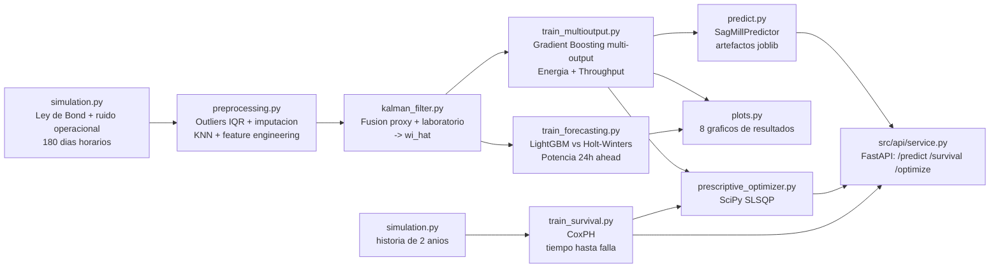
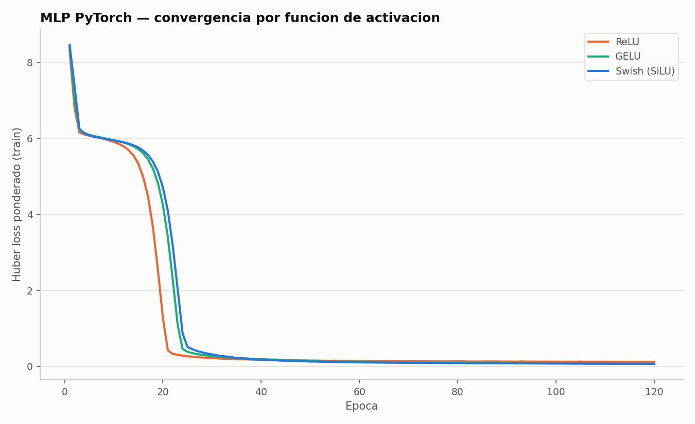
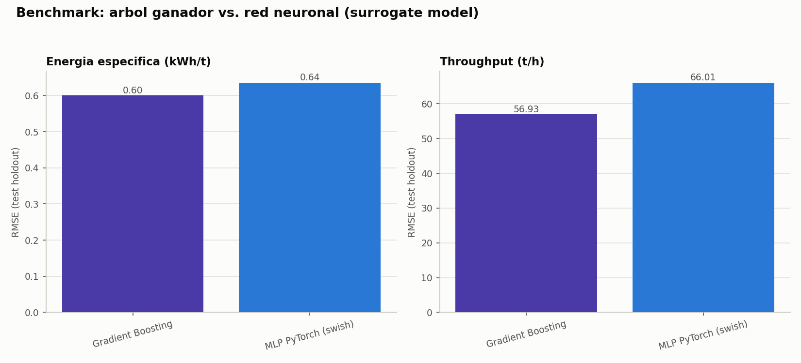

[ 🇺🇸 Read in English ](README.md) | [ 🇨🇱 Español ]

# 1. Título del Proyecto

## Gemelo Digital Predictivo de Eficiencia Energética para Molienda SAG en Minería del Cobre


Un gemelo digital que fusiona sensores ruidosos de dureza de mineral con un
**Filtro de Kalman**, predice **energía específica y throughput de un
molino SAG de forma conjunta** con **Gradient Boosting multi-output**,
anticipa la **demanda energética a 24 horas**, estima la **vida útil
remanente con Análisis de Supervivencia de Riesgos Proporcionales de
Cox (CoxPH)**, y recomienda **setpoints energéticos prescriptivos** que
equilibran el ahorro de energía contra el desgaste mecánico — todo servido
a través de un endpoint **FastAPI** con **explicabilidad SHAP punto a
punto**. Un tercer enfoque de modelado, independiente de los anteriores —
un **MLP en PyTorch** entrenado con un loss Huber normalizado por objetivo
y comparado entre activaciones ReLU/GELU/Swish — valida cruzadamente al
ensamble de árboles como surrogate model, con todas las métricas
comparativas persistidas en **DuckDB**. Todo entrenado, evaluado y
graficado por un único comando (`run_pipeline.py`), sin intervención
manual.

---

# 2. Motivación

La conminución (chancado + molienda) es, de forma consistente, **la etapa
de mayor consumo energético en una planta concentradora de cobre** —
comúnmente citada en la literatura de procesamiento de minerales como el
30-50% del consumo eléctrico total de una faena. Chile concentra
aproximadamente una cuarta parte de la producción mundial de cobre mina, y
buena parte de esa producción proviene de yacimientos porfídicos ubicados
en zonas desérticas de altura, con costos de energía estructuralmente altos
y sistemas de transmisión largos hacia el Sistema Eléctrico Nacional (SEN).

El problema operacional concreto es este: el **Índice de Trabajo de Bond
(Wi)** del mineral que entra al molino —la variable que más determina cuánta
energía se necesita para moler— **no se mide en línea**. Cambia con cada
bloque o fase de mina, y el operador solo cuenta con proxies indirectos y
ruidosos (potencia, vibración) más un ensayo de laboratorio que llega horas
después. El resultado típico es un molino que opera reactivamente respecto
a su propia capacidad instalada, en vez de anticiparse.

**Impacto económico ilustrativo** (calculado con los propios números que
este proyecto produce al ejecutarse, no una cifra de folleto): la
simulación de referencia de este repositorio arroja una potencia promedio
de **25.3 MW** sobre un molino de 28 MW instalados. A un costo industrial
de referencia de ~USD 70/MWh (rango típico citado para contratos de
suministro a gran minería en Chile), eso implica un gasto energético anual
del orden de **USD 15.5 millones para una sola línea SAG**. Una mejora de
apenas **1% en eficiencia energética específica** —el tipo de ganancia que
un soft-sensor y un modelo de setpoint predictivo pueden capturar—
equivaldría a unos **USD 155.000/año por línea**; una operación grande con
varias líneas SAG multiplica esa cifra en consecuencia. Esta cuenta es
deliberadamente ilustrativa (no es el ROI de ninguna faena específica); el
punto es que en conminución, fracciones de punto porcentual de eficiencia
energética son dinero real, no un decimal cosmético.

## 2.1 Impacto de Negocio e Indicadores Clave (KPIs)

| Métrica | Resultado | Qué significa |
|---|---|---|
| Mejor modelo multi-output (energía específica + throughput) | Gradient Boosting, R² 0,803 promedio | Le ganó incluso a LightGBM afinado con hiperparámetros -- un resultado empírico, no asumido de antemano |
| Pronóstico de demanda energética a 24h | LightGBM RMSE 2,767 MW vs. Holt-Winters 3,822 MW | **27,6%** de reducción en RMSE, **33,5%** en MAPE -- los lags capturan transiciones de régimen de dureza que un modelo solo-estacional no puede |
| Valor anual ilustrativo de una mejora de 1% en eficiencia | ~USD 155.000/año por línea SAG | Sobre un gasto energético estimado de ~USD 15,5M/año para una sola línea -- fracciones de porcentaje son dinero real en conminución |
| Bug real de calibración detectado y corregido | Parámetro P80 mal calibrado (57% de valores en el clip) → corregido | Rastreado vía un artefacto diagonal en el gráfico de residuos; split de R² balanceado 0,58/0,94 → 0,80/0,81 tras la corrección |

---

# 3. Marco Teórico

### 3.1 Tercera Ley de Bond de la conminución

La energía específica de molienda se modela con la **Tercera Ley de Bond**
(Bond, 1952), el estándar de la industria para estimar de primer orden la
energía requerida en reducción de tamaño:

```
W = 10 · Wi · ( 1/√P80 − 1/√F80 )
```

donde `W` es la energía específica (kWh/t), `Wi` es el Índice de Trabajo de
Bond del mineral (kWh/t, un proxy de dureza obtenido en laboratorio), y
`F80`/`P80` son los tamaños de partícula (µm) que pasan el 80% en
alimentación y producto respectivamente. Este proyecto usa `P80 = 150 µm`
—el tamaño típico de alimentación a flotación en cobre porfídico, y el
mismo rango (~100-150 µm) que define el propio ensayo de laboratorio del
Índice de Trabajo de Bond— por lo que la ecuación se aplica de forma
consistente con su definición original.

Sobre la energía ideal de Bond se superpone un **factor de ineficiencia
operacional** (curva en U respecto al % de llenado óptimo, la carga de
bolas y el agua de proceso): alejarse de la operación óptima siempre
incrementa el consumo específico, nunca lo reduce. Esta no-linealidad es
intencional: es la parte de la señal que la Ley de Bond por sí sola no
explica, y que un modelo de Machine Learning sí puede aprender a partir de
datos operacionales.

### 3.2 Filtro de Kalman (estimación de estado, soft-sensor)

El Wi real es un **estado oculto** que solo se observa de forma indirecta.
Modelamos su evolución como una caminata aleatoria:

```
Estado:       x_t = x_{t-1} + w_t,        w_t ~ N(0, Q)
Observación 1: z_proxy_t = x_t + v1_t,     v1_t ~ N(0, R_proxy)   (cada hora)
Observación 2: z_lab_t   = x_t + v2_t,     v2_t ~ N(0, R_lab)     (cada 8-12h)
```

El Filtro de Kalman es el **estimador lineal de mínima varianza** para este
tipo de sistema (óptimo bajo ruido gaussiano, teorema de Kalman-Bucy). En
cada paso se aplican predicción (`x_pred = x_{t-1}`, `P_pred = P_{t-1} + Q`)
y actualización secuencial por cada sensor disponible, ponderando cada
observación por la ganancia de Kalman `K = P_pred / (P_pred + R)`: cuanto
más ruidosa la fuente, menor su peso relativo en la fusión. `Q`, `R_proxy` y
`R_lab` no se fijan a mano: se **estiman empíricamente** a partir de la
volatilidad de alta frecuencia de cada serie (ver `HardnessKalmanFilter.from_data`).

### 3.3 Gradient Boosting multi-output

`specific_energy_kwh_t` y `throughput_tph` están **acoplados físicamente**
(`Potencia ≈ Energía_específica × Throughput`, a potencia instalada
aproximadamente fija): predecirlos con un solo modelo multi-output captura
esa covarianza, en vez de tratarlos como dos problemas independientes. El
Gradient Boosting de scikit-learn y LightGBM no soportan multi-output
nativo (a diferencia de Random Forest o la regresión lineal), por lo que se
envuelven en `sklearn.multioutput.MultiOutputRegressor`, que entrena un
estimador por salida pero comparte el mismo conjunto de features de
entrada. Cada árbol de boosting se ajusta secuencialmente al gradiente
negativo de la función de pérdida (residuos) del árbol anterior.

### 3.4 Forecasting de series de tiempo (24h ahead)

Se compara un baseline estadístico clásico —**Holt-Winters** (suavizamiento
exponencial triple: nivel + tendencia + estacionalidad aditiva, periodo 24)—
contra LightGBM sobre features de rezago y ventanas móviles. La validación
usa siempre **TimeSeriesSplit / walk-forward**, nunca K-Fold aleatorio: con
series de tiempo autocorrelacionadas y features de rolling-window, un fold
aleatorio filtraría información del futuro hacia el pasado, inflando
artificialmente el desempeño reportado.

### 3.5 Análisis de supervivencia (Riesgos Proporcionales de Cox)

No existe un log de fallas para el simulador (produce operación continua,
no eventos de mantenimiento), así que `train_survival.py` construye su
propio dataset de supervivencia sintético pero físicamente fundado: la
serie horaria se divide en ciclos de operación de 72 horas solapados (paso
de 24h), cada uno resumido en covariables de estrés mecánico/térmico
(desviación media respecto al % óptimo de llenado y de carga de bolas, la
variabilidad de la energía específica dentro del ciclo, y la dureza media
del mineral), y se genera un tiempo-hasta-falla por ciclo con un **modelo
de riesgos proporcionales de base Weibull**:

```
S(t | x) = S0(t)^exp(η),   η = Σ βⱼ (xⱼ − referenciaⱼ)
S0(t) = exp(−(t / b0)^k),  k = 1.8 (hazard creciente → desgaste mecanico)
```

que, invirtiendo la CDF, da un muestreador de forma cerrada para tiempos de
falla sintéticos, `T = b0 · (−ln U)^(1/k) · exp(−η/k)`. Los ciclos cuyo
tiempo de falla muestreado supera un horizonte de observación de 1.400
horas se censuran por la derecha en ese horizonte, exactamente como un
equipo que sigue operando al cierre del periodo de estudio en un dataset de
confiabilidad real. **CoxPH** (`lifelines.CoxPHFitter`) se ajusta luego
sobre los ciclos generados para recuperar esos coeficientes solo a partir
de los datos, y se evalúa con el **índice de concordancia (C-index)** — el
análogo del AUC en análisis de supervivencia — sobre un holdout
cronológico.

### 3.6 Optimización prescriptiva de setpoints

Los modelos de regresión y supervivencia *describen y predicen*; no
*recomiendan una acción*. `prescriptive_optimizer.py` cierra esa brecha:
dado un contexto operacional fijo (dureza estimada, F80/P80, estadísticas
recientes de rolling window — nada de esto controlable en el horizonte
inmediato de decisión), busca entre los setpoints controlables (tasa de
alimentación, % de llenado, carga de bolas, agua) la combinación que
minimiza un objetivo combinado —

```
minimizar   Ê[energia_especifica] + λ · (ĤR_desgaste − 1)
sujeto a    Ê[throughput] ≥ piso_throughput,  setpoints dentro de limites operacionales
```

— donde `Ê[·]` proviene directamente del modelo de regresión multi-output
entrenado y `ĤR_desgaste` es el hazard ratio de CoxPH (§3.5) implicado por
sostener la desviación de carga/carga de bolas de ese setpoint durante un
ciclo completo. `λ` (0.15 por defecto) controla cuánto ahorro de energía
está dispuesto a sacrificar el motor por riesgo de desgaste mecánico. El
problema se resuelve con `scipy.optimize.minimize` (SLSQP), tratando ambos
modelos entrenados como funciones caja-negra de objetivo/restricción en vez
de derivar una solución de forma cerrada — el mismo patrón usado en capas
de optimización en tiempo real (RTO) de sistemas de control en
procesamiento de minerales.

### 3.7 MLP en PyTorch — surrogate model y benchmark de activaciones

El ensamble de árboles del §3.3 es el modelo de producción; `train_deep_energy.py`
agrega un tercer enfoque de modelado independiente sobre **las mismas
features, los mismos targets, la misma particion cronologica** — un MLP
feed-forward (dos capas ocultas, 64 → 32 unidades) entrenado en PyTorch —
para (a) verificar cruzadamente el ensamble de árboles contra una familia
de funciones fundamentalmente distinta, y (b) medir cuanto importa la
funcion de activacion en este problema tabular, ya que la literatura no da
una respuesta unica de antemano para una regresion tabular pequena-mediana.

El loss es un **Huber normalizado por objetivo**: `throughput_tph` vive en
una escala de ~100 t/h y `specific_energy_kwh_t` en ~15 kWh/t, por lo que
residuos crudos dejarian que throughput domine el gradiente y la red
subajustaria energia. Los residuos se dividen por el desvio estandar de
cada target en train antes de aplicar `smooth_l1_loss`, lo que mantiene
ambos objetivos ponderados de forma comparable manteniendo la robustez a
outliers (horas de dureza de mineral extrema) propia de Huber:

```
resid_norm = (pred − target) / std(target | train)
loss = SmoothL1(resid_norm, 0)     # = Huber, β=1.0
```

Tres activaciones —**ReLU**, **GELU**, **Swish (SiLU)**— se entrenan con
arquitectura, optimizador (Adam), presupuesto de epocas y semilla
identicos, y se comparan en RMSE/MAE/R² de test por objetivo; la mejor se
persiste y se compara contra el mejor modelo del ensamble de árboles como
par surrogate/validacion, no como reemplazo (§7.9).

---

# 4. Explicación

## Arquitectura del pipeline



Cada etapa es un módulo independiente en `src/`, con su propio `if __name__
== "__main__"` para poder ejecutarse y depurarse de forma aislada, y
`run_pipeline.py` en la raíz orquesta las seis etapas centrales de punta a
punta con un solo comando, guardando cada artefacto intermedio
(`data/processed/`, `outputs/models/`, `outputs/reports/`,
`outputs/plots/`) para inspección o reuso. Las capas de supervivencia,
optimización prescriptiva y API son componentes de soporte a decisiones
construidos sobre los artefactos de ese pipeline central y se ejecutan por
separado (ver §6).

## Descripción de los módulos

| Módulo | Responsabilidad |
|---|---|
| [`src/data/simulation.py`](src/data/simulation.py) | Simulador horario del molino SAG fundado en la Ley de Bond, con régimen de dureza por bloques, ineficiencia operacional en U y dropout de sensores. |
| [`src/features/preprocessing.py`](src/features/preprocessing.py) | Recorte de outliers (IQR robusto), imputación (forward-fill + KNNImputer) y feature engineering (ratios, rolling stats, variables cíclicas). |
| [`src/features/kalman_filter.py`](src/features/kalman_filter.py) | Filtro de Kalman escalar con estimación empírica de Q/R y fusión secuencial de dos sensores. |
| [`src/models/train_multioutput.py`](src/models/train_multioutput.py) | Compara 5 modelos multi-output, ajusta hiperparámetros de LightGBM (`RandomizedSearchCV` + `TimeSeriesSplit`), serializa el mejor modelo. |
| [`src/models/train_forecasting.py`](src/models/train_forecasting.py) | Dataset supervisado de forecasting a 24h, comparación walk-forward LightGBM vs. Holt-Winters. |
| [`src/models/train_survival.py`](src/models/train_survival.py) | Construye el dataset sintético de ciclos de supervivencia, ajusta CoxPH, evalúa con el índice de concordancia, serializa el modelo. |
| [`src/models/train_deep_energy.py`](src/models/train_deep_energy.py) | MLP en PyTorch como surrogate model para los mismos targets multi-output; loss Huber normalizado por objetivo, comparación de activaciones ReLU/GELU/Swish, benchmark contra el ensamble de árboles. |
| [`src/models/duckdb_store.py`](src/models/duckdb_store.py) | Persiste las métricas comparativas del ensamble de árboles y del deep learning en una tabla DuckDB local (`outputs/reports/model_metrics.duckdb`) para análisis SQL entre modelos. |
| [`prescriptive_optimizer.py`](prescriptive_optimizer.py) | `PrescriptiveOptimizer`: búsqueda SLSQP sobre setpoints controlables, combinando la predicción de energía del modelo de regresión con la penalización de desgaste de CoxPH. |
| [`src/inference/predict.py`](src/inference/predict.py) | `SagMillPredictor`: replica el pipeline de features exacto de entrenamiento sobre datos crudos nuevos y sirve predicciones. |
| [`src/api/service.py`](src/api/service.py) | Servicio FastAPI: `/predict` (+ SHAP), `/survival/predict`, `/optimize`. |
| [`src/api/explain.py`](src/api/explain.py) | Construye el explainer SHAP por target apropiado al tipo de modelo que ganó el entrenamiento, y calcula contribuciones de features punto a punto. |
| [`src/visualization/plots.py`](src/visualization/plots.py) | Genera los gráficos de resultados (EDA + diagnóstico de modelos, incl. curvas de activación del deep learning y benchmark surrogate) con paleta validada para accesibilidad. |
| [`run_pipeline.py`](run_pipeline.py) | Orquestador end-to-end: simulación, preprocesamiento, Kalman, entrenamiento multi-output, forecasting, surrogate MLP en PyTorch, persistencia en DuckDB y gráficos. |

---

# 5. Metodología

- **Validación cronológica, nunca aleatoria.** El holdout final de test es
  el último 15% de la serie temporal (nunca mezclado con entrenamiento), y
  toda validación cruzada usa `TimeSeriesSplit` (5 folds, walk-forward) en
  vez de K-Fold estratificado — con features de rolling-window, un fold
  aleatorio filtraría información futura hacia atrás.
- **Outliers**: recorte robusto por rango intercuartílico (factor 3.0, no
  el clásico 1.5) sobre las variables objetivo y de potencia, para no
  recortar variación operacional legítima en un proceso intrínsecamente
  ruidoso.
- **Imputación**: forward-fill para caídas de sensor cortas (≤2h) y
  `KNNImputer` (5 vecinos, sobre variables operacionales correlacionadas)
  para el resto.
- **Optimización de hiperparámetros**: `RandomizedSearchCV` (20
  iteraciones) sobre LightGBM — `num_leaves`, `max_depth`, `learning_rate`,
  `n_estimators`, `min_child_samples`, `subsample`, `colsample_bytree` — con
  `cv=TimeSeriesSplit(5)` y `scoring="r2"`.
- **Métricas de evaluación**: RMSE, MAE y R² por salida para el modelo
  multi-output; RMSE, MAE y MAPE (%) para el forecasting, promediados sobre
  los folds walk-forward con su desviación estándar.
- **Selección de modelo**: el mejor modelo se elige por R² uniforme
  promedio sobre ambas salidas en el holdout de test, no por CV interna,
  para reportar desempeño sobre datos genuinamente no vistos.
- **Validación de supervivencia**: los ciclos de operación se dividen
  cronológicamente por `cycle_start` (nunca al azar — los ciclos se
  solapan en el tiempo por construcción), y CoxPH se evalúa con el índice
  de concordancia solo sobre los ciclos held-out.
- **Explicabilidad**: los explainers SHAP se construyen dinámicamente
  según el tipo de modelo que gana la comparación multi-output —
  `TreeExplainer` cuando el estimador ganador es de árbol (Gradient
  Boosting, LightGBM, Random Forest), con un fallback model-agnóstico para
  cualquier otro caso (ej. Regresión Lineal) — de modo que `/predict`
  nunca asume una familia de modelo fija.

---

# 6. Desarrollo

Código modular en Python, sin notebooks: cada etapa (ingesta →
procesamiento → entrenamiento → predicción → serialización) vive en su
propio módulo testeado (`tests/`, 40 tests con `pytest`), y los artefactos
de cada modelo se serializan con `joblib` (`outputs/models/*.joblib`)
junto a la lista exacta de columnas de features, para que la inferencia en
producción (`SagMillPredictor`, el servicio FastAPI) nunca dependa de
recordar el orden o nombre de las columnas de entrenamiento.

## Instalación y ejecución

```powershell
git clone https://github.com/Rxyxs/chile-mining-sag-energy-digital-twin.git
cd chile-mining-sag-energy-digital-twin
python -m venv .venv
.venv\Scripts\activate
pip install -r requirements.txt
```

### Pipeline completo (un solo comando)

```powershell
python run_pipeline.py
```

Simula 4,320 registros horarios (180 días), preprocesa, corre el Filtro de
Kalman, entrena y compara los 5 modelos multi-output (con búsqueda de
hiperparámetros), entrena y compara el forecasting, entrena el surrogate MLP
en PyTorch (3 activaciones), persiste todas las métricas comparativas en
DuckDB, y genera todos los gráficos de resultados — todo en una sola
corrida.

### Etapas individuales (para depuración)

```powershell
python -m src.data.simulation
python -m src.features.preprocessing
python -m src.features.kalman_filter
python -m src.models.train_multioutput
python -m src.models.train_forecasting
python -m src.models.train_deep_energy    # surrogate MLP en PyTorch (ReLU/GELU/Swish)
python -m src.models.duckdb_store         # persiste metricas comparativas en DuckDB
python -m src.visualization.plots
```

### Análisis de supervivencia y optimización prescriptiva

```powershell
python -m src.models.train_survival        # ajusta CoxPH, guarda outputs/models/coxph_survival_model.joblib
python prescriptive_optimizer.py            # corre un ejemplo de optimizacion sobre el ultimo registro procesado
```

### Inferencia sobre datos nuevos

```powershell
python -m src.inference.predict data/raw/sag_mill_operation_raw.parquet --output predicciones.csv
```

### Servicio API (predicción + SHAP + supervivencia + optimización prescriptiva)

```powershell
uvicorn src.api.service:app --reload
```

Luego, por ejemplo:

```powershell
curl -X POST http://127.0.0.1:8000/survival/predict `
  -H "Content-Type: application/json" `
  -d '{"load_deviation_from_optimum": 2.4, "ball_charge_deviation": 0.8, "specific_energy_std": 1.0, "hardness_proxy_wi_mean": 13.0}'
```

La documentación interactiva (Swagger UI) queda disponible en
`http://127.0.0.1:8000/docs` una vez que el servicio está corriendo.

### Tests

```powershell
pytest
```

## Estructura

```
chile-mining-sag-energy-digital-twin/
├── data/
│   ├── raw/                       # crudo simulado (parquet, generado)
│   └── processed/                 # limpio + features + Kalman (generado)
├── outputs/
│   ├── models/                    # modelos de regresion + CoxPH + artefactos MLP PyTorch (joblib/.pt, generado)
│   ├── reports/                   # métricas, comparaciones, residuos, reporte de supervivencia, archivo DuckDB (generado)
│   └── plots/                     # gráficos de resultados (png, versionados)
├── src/
│   ├── data/simulation.py
│   ├── features/{preprocessing,kalman_filter}.py
│   ├── models/{train_multioutput,train_forecasting,train_survival,train_deep_energy,duckdb_store}.py
│   ├── inference/predict.py
│   ├── api/{service,explain}.py
│   └── visualization/plots.py
├── prescriptive_optimizer.py      # optimizacion SLSQP de setpoints (energia vs. desgaste)
├── tests/                         # 40 tests, pytest
├── run_pipeline.py                # orquestador end-to-end (8 etapas)
└── requirements.txt
```

---

# 7. Resultados

Todos los números y gráficos de esta sección provienen de una corrida real
de `run_pipeline.py` (seed 42, 4,320 registros horarios = 180 días,
holdout cronológico de 648 registros = 15%).

## 7.1 Filtro de Kalman — fusión de sensores de dureza

| Fuente | RMSE vs. Wi real |
|---|---|
| Proxy crudo en línea (sin filtrar) | 2.601 kWh/t |
| **Estimación Kalman (fusión proxy + laboratorio)** | **0.545 kWh/t** |
| **Reducción de error** | **79.0%** |


## 7.2 Análisis exploratorio — correlaciones


La estimación Kalman (`wi_hat`) correlaciona 0.89 con la energía específica
real y −0.67 con el throughput — consistente con la física de Bond: mineral
más duro exige más energía por tonelada y, a potencia limitada, obliga a
bajar el throughput. `fresh_feed_tph` y `throughput_tph` correlacionan 0.42
(no 1.0): la diferencia es exactamente el régimen en que la potencia
instalada, no el setpoint del alimentador, es la restricción activa.

## 7.3 Modelo multi-output — comparación de modelos

**Energía específica (kWh/t)**

| Modelo | RMSE | MAE | R² |
|---|---|---|---|
| Regresión Lineal | 0.666 | 0.541 | 0.755 |
| Random Forest | 0.953 | 0.752 | 0.499 |
| **Gradient Boosting** | **0.600** | **0.474** | **0.801** |
| LightGBM | 0.622 | 0.489 | 0.787 |
| LightGBM (tuned) | 0.604 | 0.477 | 0.799 |

**Throughput (t/h)**

| Modelo | RMSE | MAE | R² |
|---|---|---|---|
| Regresión Lineal | 94.23 | 74.53 | 0.467 |
| Random Forest | 60.21 | 46.15 | 0.783 |
| **Gradient Boosting** | **56.93** | **40.68** | **0.806** |
| LightGBM | 58.97 | 44.29 | 0.791 |
| LightGBM (tuned) | 58.10 | 43.31 | 0.797 |

**Gradient Boosting (sin ajustar) fue el mejor modelo** (R² uniforme
promedio = 0.803 sobre ambas salidas) — superó incluso a LightGBM con
búsqueda de hiperparámetros, un resultado empírico, no asumido de
antemano.


## 7.4 Importancia de variables (mejor modelo)

| # | Variable | Importancia |
|---|---|---|
| 1 | `wi_hat` (estimación Kalman de dureza) | 0.737 |
| 2 | `fresh_feed_tph` | 0.104 |
| 3 | `p80_um` | 0.064 |
| 4 | `water_addition_m3h` | 0.034 |
| 5 | `hardness_proxy_wi_roll_mean_6h` | 0.025 |


La variable más importante del modelo predictivo **es exactamente la que
produce el Filtro de Kalman**: el soft-sensor no es un ejercicio académico
aislado, es la señal que más explica el consumo energético del molino.

## 7.5 Curva de aprendizaje y residuos


La curva de validación se estabiliza cerca de R² ≈ 0.78-0.79 desde ~500
registros de entrenamiento en adelante, con una brecha moderada respecto al
entrenamiento (R² ≈ 0.96-1.00) — indicio de varianza controlada, no de
sobreajuste severo.


Los residuos de ambas salidas se distribuyen simétricamente alrededor de
cero sin patrón sistemático evidente respecto a la predicción
(homocedasticidad razonable).

## 7.6 Forecasting de demanda energética (24h ahead)

| Modelo | RMSE (MW) | MAE (MW) | MAPE (%) |
|---|---|---|---|
| Holt-Winters (baseline clásico) | 3.822 | 3.035 | 12.97% |
| **LightGBM (lags + rolling)** | **2.767** | **2.097** | **8.62%** |

LightGBM reduce el RMSE en **27.6%** y el MAPE en **33.5%** respecto al
baseline estadístico clásico — el historial reciente (lags) capta
transiciones de régimen de dureza que un modelo puramente estacional no
puede anticipar.


## 7.7 Análisis de supervivencia (CoxPH) — tiempo hasta falla mecánica

De una corrida real de `train_survival.py` (historia simulada de 2 años,
718 ciclos solapados de 72 horas, split cronológico 80/20):

| | |
|---|---|
| Ciclos train / test | 574 / 144 |
| Eventos observados (train / test) | 540 / 141 |
| **Índice de concordancia (test)** | **0.661** |
| Test de razón de verosimilitud | p = 5.9 × 10⁻⁴⁴ |

| Covariable | log-HR estimado | log-HR verdadero | Hazard ratio | p-valor |
|---|---:|---:|---:|---:|
| **Volatilidad de energía específica** | **1.833** | 1.40 | **6.26×** | **< 10⁻⁴³** |
| **Dureza media del mineral (Wi)** | **0.154** | 0.14 | **1.17×** | **< 10⁻¹⁰** |
| Desviación de carga respecto al óptimo | -0.159 | 0.10 | 0.85× | 0.447 (n.s.) |
| Desviación de carga de bolas | -0.068 | 0.12 | 0.93× | 0.919 (n.s.) |

CoxPH recupera correcta y precisamente los dos factores de riesgo
dominantes (volatilidad de energía y dureza del mineral — ambas variables
de contexto que el operador no fija directamente), con un C-index de
0.661: mejor que el azar (0.5) de forma significativa, pero honestamente
lejos de un predictor determinístico, consistente con lo ruidosa que es en
realidad la señal de falla mecánica. Las dos desviaciones de setpoint
directamente controlables (carga, carga de bolas) resultan
**estadísticamente no significativas** (p > 0.4): los operadores ya
mantienen estos valores cerca de su óptimo por diseño, así que su varianza
ciclo a ciclo es demasiado pequeña para que este dataset identifique un
efecto confiable — un hallazgo honesto, no una falla de modelado, y la
razón por la que el término de penalización de desgaste en §7.8 se
pondera deliberadamente bajo (`λ = 0.15`).

## 7.8 Optimización prescriptiva — ejemplo desarrollado

Aplicando `prescriptive_optimizer.py` al registro más reciente del dataset
procesado (`min_throughput_tph` = 97% de la alimentación actual):

| | Base (setpoints actuales) | Recomendado |
|---|---:|---:|
| `mill_load_pct` | 26.71% | 25.21% |
| `ball_charge_pct` | 11.02% | 11.67% |
| Energía específica (predicha) | 12.041 kWh/t | 12.072 kWh/t |
| Throughput (predicho) | 2.267,9 t/h | 2.258,4 t/h |
| Hazard ratio de desgaste (CoxPH) | 4.09× | **3.08×** |

Para este contexto particular, el optimizador cambia un pequeño aumento de
energía (+0.26%) por una **reducción de ~25% en el hazard ratio de
desgaste de CoxPH** — el objetivo combinado (§3.6) funciona como fue
diseñado, no colapsa a un minimizador puro de energía. Dado que el efecto
directo de la desviación de setpoint sobre el riesgo mecánico es
estadísticamente débil (§7.7), este trade-off es intencionalmente
conservador; el valor central del motor es el marco mismo — optimizar
conjuntamente un modelo predictivo y uno de supervivencia bajo
restricciones explícitas — más que este resultado numérico puntual.

## 7.9 Surrogate MLP en PyTorch — comparación de activaciones y benchmark vs. ensamble de árboles

De una corrida real de `train_deep_energy.py` sobre la misma partición
cronológica del §7.3 (3.672 train / 648 test), 120 épocas, misma
arquitectura y semilla por activación:

| Activación | RMSE energía específica | RMSE throughput | R² global |
|---|---:|---:|---:|
| ReLU | 0.690 | 103.87 | 0.545 |
| GELU | 0.638 | 74.01 | 0.724 |
| **Swish (SiLU)** | **0.635** | **66.01** | **0.758** |



Swish generaliza mejor de las tres, apenas por delante de GELU y
claramente por delante de ReLU en esta arquitectura — consistente con el
gradiente suave y no monótono cerca de cero que comparten Swish y GELU,
que ayuda más a la optimización que el corte duro en cero de ReLU en esta
profundidad/ancho. Es un resultado empírico específico de este dataset y
tamaño de red, no una afirmación general de que Swish supere a ReLU en
todo contexto.

**MLP (Swish) vs. ensamble de árboles (Gradient Boosting, §7.3) — mismo set de test:**

| | Gradient Boosting (árbol) | MLP PyTorch (Swish) |
|---|---:|---:|
| RMSE energía específica | **0.600** | 0.635 |
| RMSE throughput | **56.93** | 66.01 |
| R² global | **0.803** | 0.758 |



El ensamble de árboles se mantiene como modelo de producción — supera al
MLP en ambos targets — pero el surrogate neuronal queda a ~4.5 puntos de R²
usando una familia de funciones completamente distinta y sin feature
engineering especifico de árboles, lo que valida cruzadamente que el
desempeño del modelo de árboles refleja una señal genuina y recuperable, no
un artefacto de una sola familia de algoritmos. Todas las métricas
comparativas (modelos de árbol + activaciones del MLP) se persisten
adicionalmente en una tabla DuckDB local
(`outputs/reports/model_metrics.duckdb`, `model_comparison`) para análisis
SQL ad-hoc.

---

# 8. Conclusión

- **El Filtro de Kalman funciona y se demuestra que importa**: reduce el
  error de estimación de dureza en 79% frente al proxy crudo, y la
  variable resultante (`wi_hat`) termina siendo, por un margen amplio, la
  más importante del modelo predictivo (73.7% de la ganancia total). Esto
  valida la inversión en un soft-sensor de dureza como algo con retorno
  medible, no un componente decorativo.
- **El acoplamiento físico entre energía y throughput es real y
  aprendible**: un modelo multi-output alcanza R² ≈ 0.80 en ambas salidas
  simultáneamente, y el ganador (Gradient Boosting sin ajustar) superó
  incluso a la versión de LightGBM con búsqueda de hiperparámetros — un
  recordatorio de que más complejidad no siempre gana, y de que hay que
  medir en vez de asumir.
- **El forecasting basado en Machine Learning supera al baseline
  estadístico clásico en 27.6%** para anticipar la demanda energética a 24
  horas, con un margen que se explica por la capacidad de capturar
  transiciones de régimen de dureza que Holt-Winters, por diseño puramente
  estacional, no puede ver venir.
- **El análisis de supervivencia transforma "predecir energía" en
  "predecir vida útil remanente"**: CoxPH recupera los dos factores
  dominantes y estadísticamente significativos del riesgo mecánico
  (volatilidad de energía específica, dureza del mineral) con un C-index
  de test de 0.661, y reporta honestamente que los setpoints directamente
  controlados por el operador no muestran efecto marginal significativo en
  este dataset — un hallazgo, no una falla, que da forma directamente al
  peso que el motor prescriptivo debe asignar al riesgo de desgaste.
- **La optimización prescriptiva cierra el ciclo de predicción a
  recomendación**: `prescriptive_optimizer.py` no solo describe el
  trade-off energía/throughput, recomienda un setpoint concreto,
  equilibrando el consumo de energía predicho contra el hazard de desgaste
  estimado por CoxPH, sujeto a una restricción de throughput mínimo — el
  mismo tipo de problema que resuelve una capa de optimización en tiempo
  real (RTO) en una sala de control de procesamiento de minerales.
- **Recomendaciones operacionales**: (1) instrumentar el soft-sensor Kalman
  como insumo directo del panel del operador de sala de control, no solo
  del modelo; (2) usar el forecast a 24h como insumo para la programación
  de mantenimientos y la gestión de compra de energía spot; (3) servir el
  modelo multi-output, el modelo de supervivencia y el optimizador
  prescriptivo a través de los endpoints FastAPI de este repositorio como
  advisor de setpoint en tiempo real, especialmente en las transiciones de
  bloque donde el operador hoy reacciona con retraso; (4) registrar la
  explicación SHAP junto a cada predicción servida, no solo el número, para
  que los operadores puedan auditar *por qué* el modelo recomienda lo que
  recomienda.
- **Limitación central, y la más importante de nombrar**: los datos son
  sintéticos, generados por este mismo repositorio a partir de la Ley de
  Bond más ruido operacional — no telemetría SCADA propietaria de ninguna
  faena, y el dataset de supervivencia es sintético sobre sintético
  (tiempos de falla simulados sobre una historia operacional simulada).
  Las métricas demuestran que el *pipeline* es correcto (arquitectura,
  validación sin fuga temporal, calibración física y estadística
  verificable), no que el modelo prediga la operación real de un molino
  específico ni un historial de mantenimiento real. El paso crítico antes
  de cualquier uso productivo es recalibrar contra telemetría histórica
  real y un log de fallas/mantenimiento real.

## Trabajo futuro

- Reemplazar el simulador por telemetría histórica real de planta
  (SCADA/PI) y un log real de mantenimiento/fallas para recalibrar tanto
  el modelo de regresión como el de supervivencia contra datos reales.
- Agregar un dashboard operacional liviano (Streamlit) que consuma los
  endpoints de FastAPI, siguiendo el mismo patrón de otros proyectos de
  este portafolio.
- Extender el modelo de supervivencia más allá del supuesto de riesgos
  proporcionales de CoxPH (ej. covariables variables en el tiempo o un
  Random Survival Forest) una vez disponibles datos reales de falla, para
  probar si el riesgo realmente se mantiene proporcional a lo largo de la
  vida del molino.
- Mover el optimizador prescriptivo de una recomendación puntual a una
  formulación de horizonte deslizante (estilo Model Predictive Control)
  que se re-optimice a medida que llegan nuevas lecturas de sensores.

---

# 9. Autor

**Pablo Reyes** — [github.com/Rxyxs](https://github.com/Rxyxs)
