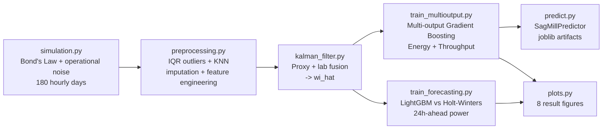

[ 🇺🇸 English ] | [ 🇨🇱 Leer en Español ](README.es.md)

# 1. Project Title

## Predictive Digital Twin for SAG Mill Energy Efficiency in Copper Mining


A digital twin that fuses noisy ore-hardness sensors with a **Kalman
Filter**, jointly predicts a SAG mill's **specific energy and throughput**
with **multi-output Gradient Boosting**, and forecasts **24-hour-ahead
energy demand**, benchmarking a classical statistical baseline
(Holt-Winters) against a Machine Learning approach — all trained,
evaluated, and plotted by a single command (`run_pipeline.py`), with no
manual steps in between.

---

# 2. Motivation

Comminution (crushing + grinding) is consistently **the single largest
energy consumer in a copper concentrator** — commonly cited in mineral
processing literature as 30-50% of a site's total electricity consumption.
Chile accounts for roughly a quarter of world mined copper, much of it from
porphyry deposits in high-altitude desert zones, with structurally high
energy costs and long transmission lines feeding into the Sistema
Eléctrico Nacional (SEN).

The concrete operational problem is this: the **Bond Work Index (Wi)** of
the ore entering the mill — the single variable that most determines how
much energy grinding will take — **is not measured online**. It shifts
with every mining block or phase, and the operator only has noisy indirect
proxies (power, vibration) plus a lab assay that arrives hours later. The
typical result is a mill that reacts to its own installed capacity instead
of anticipating it.

**Illustrative economic impact** (computed from this project's own output
after actually running it, not a brochure figure): this repository's
reference simulation produces an average power draw of **25.3 MW** on a
28 MW installed SAG mill. At a representative industrial electricity cost
of ~USD 70/MWh (a range commonly cited for large-mining supply contracts in
Chile), that implies an annual energy bill on the order of **USD 15.5
million for a single SAG line**. A mere **1% improvement in specific
energy efficiency** — the kind of gain a soft-sensor and a predictive
setpoint model can realistically capture — would be worth roughly
**USD 155,000/year per line**; a large operation running several SAG
lines scales that figure accordingly. This calculation is deliberately
illustrative (it is not any specific site's ROI); the point is that in
comminution, fractions of a percentage point of energy efficiency are real
money, not a rounding error.

---

# 3. Theoretical Framework

### 3.1 Bond's Third Law of Comminution

Specific grinding energy is modeled with **Bond's Third Law** (Bond,
1952), the industry-standard first-order estimate of size-reduction
energy:

```
W = 10 · Wi · ( 1/√P80 − 1/√F80 )
```

where `W` is specific energy (kWh/t), `Wi` is the ore's Bond Work Index
(kWh/t, a lab-derived hardness proxy), and `F80`/`P80` are the 80%-passing
particle sizes (µm) of feed and product respectively. This project uses
`P80 = 150 µm` — the typical flotation-feed grind size for porphyry
copper, and the same range (~100-150 µm) that defines the Bond Work Index
laboratory test itself — so the equation is applied consistently with its
original definition.

An **operational inefficiency factor** (a U-shaped penalty around the
optimal % mill filling, ball charge, and process water) is layered on top
of the ideal Bond energy: deviating from optimal operation always
increases specific consumption, never reduces it. This non-linearity is
deliberate — it's the part of the signal Bond's law alone cannot explain,
and that a Machine Learning model can learn directly from operational
data.

### 3.2 Kalman Filter (state estimation, soft sensor)

The true Wi is a **hidden state** observed only indirectly. Its evolution
is modeled as a random walk:

```
State:          x_t = x_{t-1} + w_t,        w_t ~ N(0, Q)
Observation 1:  z_proxy_t = x_t + v1_t,      v1_t ~ N(0, R_proxy)  (hourly)
Observation 2:  z_lab_t   = x_t + v2_t,      v2_t ~ N(0, R_lab)    (every 8-12h)
```

The Kalman Filter is the **minimum-variance linear estimator** for this
class of system (optimal under Gaussian noise, per the Kalman-Bucy
theorem). Each step runs a prediction (`x_pred = x_{t-1}`,
`P_pred = P_{t-1} + Q`) followed by a sequential update for each available
sensor, weighting each observation by the Kalman gain
`K = P_pred / (P_pred + R)`: noisier sources get proportionally less
weight in the fusion. `Q`, `R_proxy`, and `R_lab` are not hand-tuned — they
are **estimated empirically** from each series' high-frequency volatility
(see `HardnessKalmanFilter.from_data`).

### 3.3 Multi-output Gradient Boosting

`specific_energy_kwh_t` and `throughput_tph` are **physically coupled**
(`Power ≈ Specific_Energy × Throughput`, at roughly fixed installed
power): predicting them with one multi-output model captures that
covariance instead of treating them as two independent problems. Neither
scikit-learn's Gradient Boosting nor LightGBM support native multi-output
regression (unlike Random Forest or linear regression), so both are
wrapped in `sklearn.multioutput.MultiOutputRegressor`, which trains one
estimator per output while sharing the same input feature set. Each
boosting tree is fit sequentially on the negative gradient (residuals) of
the loss from the previous tree.

### 3.4 Time series forecasting (24h ahead)

A classical statistical baseline — **Holt-Winters** (triple exponential
smoothing: level + trend + additive seasonality, period 24) — is
benchmarked against LightGBM over lag and rolling-window features.
Validation always uses **TimeSeriesSplit / walk-forward**, never random
K-Fold: with autocorrelated time series and rolling-window features, a
random fold would leak future information into the past, artificially
inflating reported performance.

---

# 4. Explanation

## Pipeline architecture



Each stage is an independent module under `src/`, with its own
`if __name__ == "__main__"` entrypoint so it can run and be debugged in
isolation, and `run_pipeline.py` at the repository root orchestrates all
six stages end to end with a single command, persisting every intermediate
artifact (`data/processed/`, `outputs/models/`, `outputs/reports/`,
`outputs/plots/`) for inspection or reuse.

## Module responsibilities

| Module | Responsibility |
|---|---|
| [`src/data/simulation.py`](src/data/simulation.py) | Hourly SAG mill simulator grounded in Bond's Law, with block-regime hardness, U-shaped operational inefficiency, and sensor dropout. |
| [`src/features/preprocessing.py`](src/features/preprocessing.py) | Outlier clipping (robust IQR), imputation (forward-fill + KNNImputer), and feature engineering (ratios, rolling stats, cyclical variables). |
| [`src/features/kalman_filter.py`](src/features/kalman_filter.py) | Scalar Kalman Filter with empirically-estimated Q/R and sequential two-sensor fusion. |
| [`src/models/train_multioutput.py`](src/models/train_multioutput.py) | Compares 5 multi-output models, tunes LightGBM hyperparameters (`RandomizedSearchCV` + `TimeSeriesSplit`), serializes the best model. |
| [`src/models/train_forecasting.py`](src/models/train_forecasting.py) | 24h-ahead supervised forecasting dataset, walk-forward LightGBM vs. Holt-Winters comparison. |
| [`src/inference/predict.py`](src/inference/predict.py) | `SagMillPredictor`: replicates the exact training-time feature pipeline on new raw data and serves predictions. |
| [`src/visualization/plots.py`](src/visualization/plots.py) | Generates the 8 result figures (EDA + model diagnostics) with an accessibility-validated palette. |
| [`run_pipeline.py`](run_pipeline.py) | End-to-end orchestrator for the six stages above. |

---

# 5. Methodology

- **Chronological validation, never random.** The final test holdout is
  the last 15% of the time series (never mixed with training), and all
  cross-validation uses `TimeSeriesSplit` (5 folds, walk-forward) instead
  of stratified K-Fold — with rolling-window features, a random fold would
  leak future information backward.
- **Outliers**: robust interquartile-range clipping (factor 3.0, not the
  classic 1.5) on the target and power variables, so legitimate
  operational variation in an intrinsically noisy process isn't clipped
  away.
- **Imputation**: forward-fill for short sensor dropouts (≤2h) and
  `KNNImputer` (5 neighbors, over correlated operational variables) for
  the rest.
- **Hyperparameter optimization**: `RandomizedSearchCV` (20 iterations)
  over LightGBM — `num_leaves`, `max_depth`, `learning_rate`,
  `n_estimators`, `min_child_samples`, `subsample`, `colsample_bytree` —
  with `cv=TimeSeriesSplit(5)` and `scoring="r2"`.
- **Evaluation metrics**: RMSE, MAE, and R² per output for the
  multi-output model; RMSE, MAE, and MAPE (%) for forecasting, averaged
  across walk-forward folds with their standard deviation.
- **Model selection**: the best model is chosen by uniform-average R²
  across both outputs on the test holdout, not internal CV, so reported
  performance reflects genuinely unseen data.

---

# 6. Development

Modular Python code, no notebooks: each stage (ingestion → processing →
training → prediction → serialization) lives in its own tested module
(`tests/`, 22 tests via `pytest`), and the best model's artifacts are
serialized with `joblib` (`outputs/models/*.joblib`) alongside the exact
list of feature columns, so production inference (`SagMillPredictor`)
never depends on remembering training-time column order or naming.

## Installation and setup

```powershell
git clone https://github.com/Rxyxs/chile-mining-sag-energy-digital-twin.git
cd chile-mining-sag-energy-digital-twin
python -m venv .venv
.venv\Scripts\activate
pip install -r requirements.txt
```

### Full pipeline (one command)

```powershell
python run_pipeline.py
```

Simulates 4,320 hourly records (180 days), preprocesses, runs the Kalman
Filter, trains and compares all 5 multi-output models (with hyperparameter
search), trains and compares the forecasting models, and generates all 8
result figures — in a single run.

### Individual stages (for debugging)

```powershell
python -m src.data.simulation
python -m src.features.preprocessing
python -m src.features.kalman_filter
python -m src.models.train_multioutput
python -m src.models.train_forecasting
python -m src.visualization.plots
```

### Inference on new data

```powershell
python -m src.inference.predict data/raw/sag_mill_operation_raw.parquet --output predictions.csv
```

### Tests

```powershell
pytest
```

## Project structure

```
chile-mining-sag-energy-digital-twin/
├── data/
│   ├── raw/                       # simulated raw data (parquet, generated)
│   └── processed/                 # cleaned + features + Kalman (generated)
├── outputs/
│   ├── models/                    # best model + feature columns (joblib, generated)
│   ├── reports/                   # metrics, comparisons, residuals (json/csv, generated)
│   └── plots/                     # 8 result figures (png, version-controlled)
├── src/
│   ├── data/simulation.py
│   ├── features/{preprocessing,kalman_filter}.py
│   ├── models/{train_multioutput,train_forecasting}.py
│   ├── inference/predict.py
│   └── visualization/plots.py
├── tests/                         # 22 tests, pytest
├── run_pipeline.py                # end-to-end orchestrator
└── requirements.txt
```

---

# 7. Results

Every number and figure in this section comes from an actual run of
`run_pipeline.py` (seed 42, 4,320 hourly records = 180 days, chronological
holdout of 648 records = 15%).

## 7.1 Kalman Filter — hardness sensor fusion

| Source | RMSE vs. true Wi |
|---|---|
| Raw online proxy (unfiltered) | 2.601 kWh/t |
| **Kalman estimate (proxy + lab fusion)** | **0.545 kWh/t** |
| **Error reduction** | **79.0%** |


## 7.2 Exploratory analysis — correlations


The Kalman estimate (`wi_hat`) correlates 0.89 with true specific energy
and −0.67 with throughput — consistent with Bond's physics: harder ore
demands more energy per tonne and, under a fixed power ceiling, forces
throughput down. `fresh_feed_tph` and `throughput_tph` correlate at only
0.42 (not 1.0): the gap is exactly the regime where installed power, not
the feeder setpoint, is the binding constraint.

## 7.3 Multi-output model — model comparison

**Specific energy (kWh/t)**

| Model | RMSE | MAE | R² |
|---|---|---|---|
| Linear Regression | 0.666 | 0.541 | 0.755 |
| Random Forest | 0.953 | 0.752 | 0.499 |
| **Gradient Boosting** | **0.600** | **0.474** | **0.801** |
| LightGBM | 0.622 | 0.489 | 0.787 |
| LightGBM (tuned) | 0.604 | 0.477 | 0.799 |

**Throughput (t/h)**

| Model | RMSE | MAE | R² |
|---|---|---|---|
| Linear Regression | 94.23 | 74.53 | 0.467 |
| Random Forest | 60.21 | 46.15 | 0.783 |
| **Gradient Boosting** | **56.93** | **40.68** | **0.806** |
| LightGBM | 58.97 | 44.29 | 0.791 |
| LightGBM (tuned) | 58.10 | 43.31 | 0.797 |

**Untuned Gradient Boosting was the best model** (uniform-average R² =
0.803 across both outputs) — it beat even the hyperparameter-tuned
LightGBM, an empirical result, not one assumed in advance.


## 7.4 Feature importance (best model)

| # | Feature | Importance |
|---|---|---|
| 1 | `wi_hat` (Kalman hardness estimate) | 0.737 |
| 2 | `fresh_feed_tph` | 0.104 |
| 3 | `p80_um` | 0.064 |
| 4 | `water_addition_m3h` | 0.034 |
| 5 | `hardness_proxy_wi_roll_mean_6h` | 0.025 |


The single most important feature in the predictive model **is exactly
what the Kalman Filter produces**: the soft sensor isn't an isolated
academic exercise — it's the signal that most explains the mill's energy
consumption.

## 7.5 Learning curve and residuals


The validation curve stabilizes around R² ≈ 0.78-0.79 from ~500 training
records onward, with a moderate gap versus training performance
(R² ≈ 0.96-1.00) — a sign of controlled variance, not severe overfitting.


Residuals for both outputs are symmetrically distributed around zero with
no obvious systematic pattern against the prediction (reasonable
homoscedasticity).

## 7.6 Energy demand forecasting (24h ahead)

| Model | RMSE (MW) | MAE (MW) | MAPE (%) |
|---|---|---|---|
| Holt-Winters (classical baseline) | 3.822 | 3.035 | 12.97% |
| **LightGBM (lags + rolling)** | **2.767** | **2.097** | **8.62%** |

LightGBM cuts RMSE by **27.6%** and MAPE by **33.5%** relative to the
classical statistical baseline — recent history (lags) captures
hardness-regime transitions that a purely seasonal model cannot
anticipate.


---

# 8. Conclusion

- **The Kalman Filter works, and its value is demonstrated, not assumed**:
  it cuts hardness-estimation error by 79% versus the raw proxy, and the
  resulting feature (`wi_hat`) ends up being, by a wide margin, the most
  important input to the predictive model (73.7% of total gain). That
  validates the hardness soft-sensor as something with measurable return,
  not a decorative add-on.
- **The physical coupling between energy and throughput is real and
  learnable**: a single multi-output model reaches R² ≈ 0.80 on both
  outputs simultaneously, and the winner (untuned Gradient Boosting) beat
  even the hyperparameter-tuned LightGBM — a reminder that more complexity
  doesn't always win, and that this should be measured, not assumed.
- **ML-based forecasting beats the classical statistical baseline by
  27.6%** for anticipating 24-hour-ahead energy demand, a margin explained
  by its ability to capture hardness-regime transitions that Holt-Winters,
  by purely seasonal design, cannot see coming.
- **Operational recommendations**: (1) surface the Kalman soft-sensor
  directly on the control-room operator's panel, not only as a model
  input; (2) use the 24h-ahead forecast as an input to maintenance
  scheduling and spot energy procurement; (3) use the multi-output model
  as a real-time setpoint advisor for the throughput-vs-grind-fineness
  trade-off, especially during block transitions where operators today
  react with a lag.
- **The central limitation, and the most important one to name**: the
  data is synthetic, generated by this repository itself from Bond's Law
  plus operational noise — not proprietary SCADA telemetry from any site.
  The metrics show the *pipeline* is correct (architecture, leak-free
  validation, verifiable physical calibration), not that the model
  predicts a specific real mill's operation. The critical next step before
  any productive use is recalibration against real historical telemetry.

## Future work

- Replace the simulator with real historical plant telemetry (SCADA/PI).
- Expose `SagMillPredictor` behind a FastAPI service and an operational
  dashboard (Streamlit), following the same pattern used in other projects
  in this portfolio.
- Add per-prediction SHAP explainability, not just global importance.
- Extend with a Survival Analysis (CoxPH) component for time-to-unplanned-
  stop, complementary to this energy-efficiency digital twin.
- A prescriptive optimization engine: given an estimated hardness regime,
  recommend the setpoint (feed rate, water, ball charge) that maximizes
  throughput subject to the installed power ceiling.

---

# 9. Author

**Pablo Reyes** — [github.com/Rxyxs](https://github.com/Rxyxs)
