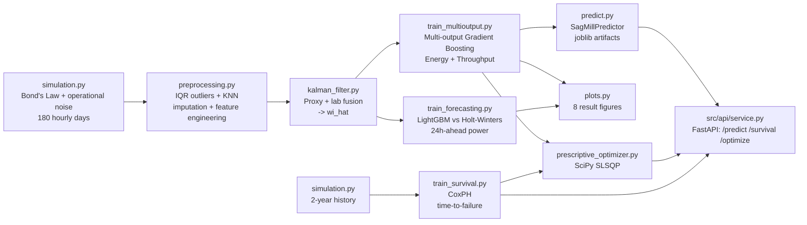
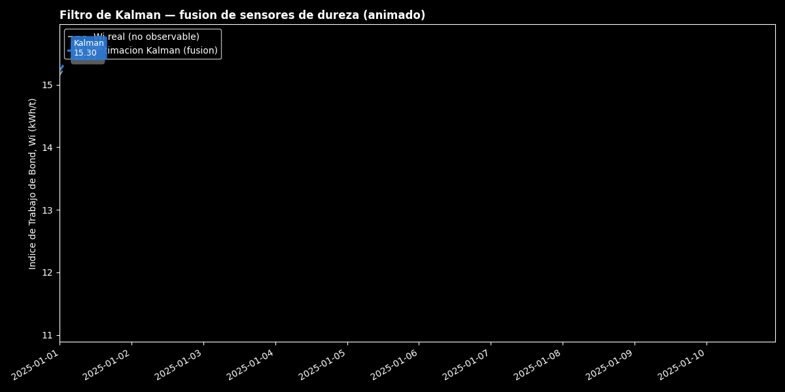
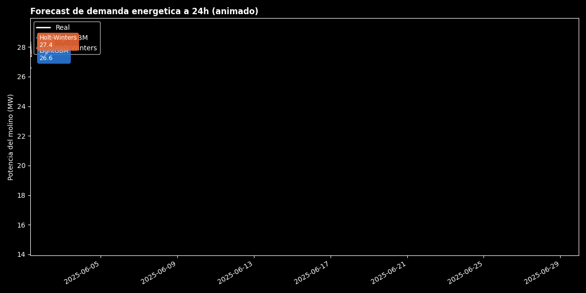
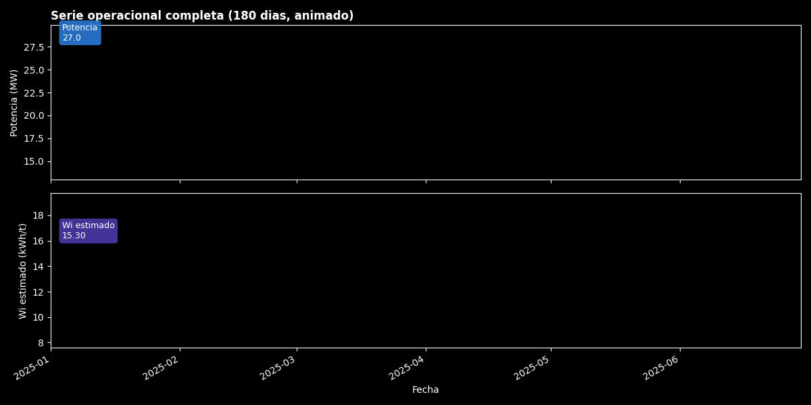

[ 🇺🇸 English ] | [ 🇨🇱 Leer en Español ](README.es.md)

# 1. Project Title

## Predictive Digital Twin for SAG Mill Energy Efficiency in Copper Mining


A digital twin that fuses noisy ore-hardness sensors with a **Kalman
Filter**, jointly predicts a SAG mill's **specific energy and throughput**
with **multi-output Gradient Boosting**, forecasts **24-hour-ahead energy
demand**, estimates **remaining mechanical life with Cox Proportional
Hazards survival analysis**, and recommends **prescriptive energy setpoints**
that trade off energy savings against mechanical wear — all served through a
**FastAPI** endpoint with **point-to-point SHAP explainability**. A third,
independent modeling approach — a **PyTorch MLP** trained with a
per-target-normalized Huber loss and benchmarked across ReLU/GELU/Swish
activations — cross-validates the tree ensemble as a surrogate model, with
all comparison metrics persisted to **DuckDB**. All of it is trained,
evaluated, and plotted by a single command (`run_pipeline.py`), with no
manual steps in between.

---

# 2. Motivation

Comminution (crushing + grinding) is consistently **the single largest
energy consumer in a copper concentrator** — commonly cited in mineral
processing literature as 30-50% of a site's total electricity consumption.
Chile accounts for roughly a quarter of world mined copper, much of it from
porphyry deposits in high-altitude desert zones, with structurally high
energy costs and long transmission lines feeding into the Sistema
Eléctrico Nacional (SEN).

The concrete operational problem is this: the **Bond Work Index (Wi)** of
the ore entering the mill — the single variable that most determines how
much energy grinding will take — **is not measured online**. It shifts
with every mining block or phase, and the operator only has noisy indirect
proxies (power, vibration) plus a lab assay that arrives hours later. The
typical result is a mill that reacts to its own installed capacity instead
of anticipating it.

**Illustrative economic impact** (computed from this project's own output
after actually running it, not a brochure figure): this repository's
reference simulation produces an average power draw of **25.3 MW** on a
28 MW installed SAG mill. At a representative industrial electricity cost
of ~USD 70/MWh (a range commonly cited for large-mining supply contracts in
Chile), that implies an annual energy bill on the order of **USD 15.5
million for a single SAG line**. A mere **1% improvement in specific
energy efficiency** — the kind of gain a soft-sensor and a predictive
setpoint model can realistically capture — would be worth roughly
**USD 155,000/year per line**; a large operation running several SAG
lines scales that figure accordingly. This calculation is deliberately
illustrative (it is not any specific site's ROI); the point is that in
comminution, fractions of a percentage point of energy efficiency are real
money, not a rounding error.

## 2.1 Business Impact & Key Performance Indicators

| Metric | Result | What it means |
|---|---|---|
| Best multi-output model (specific energy + throughput) | Gradient Boosting, R² 0.803 avg | Beat even hyperparameter-tuned LightGBM -- an empirical result, not assumed in advance |
| 24h-ahead energy demand forecast | LightGBM RMSE 2.767 MW vs. Holt-Winters 3.822 MW | **27.6%** RMSE reduction, **33.5%** MAPE reduction -- lags capture hardness-regime transitions a seasonal-only model can't |
| Illustrative annual value of 1% efficiency gain | ~USD 155,000/year per SAG line | On an estimated ~USD 15.5M/year energy bill for a single line -- fractions of a percent are real money in comminution |
| Real calibration bug caught and fixed | P80 parameter miscalibration (57% of values clipped) → fixed | Traced via a residual-plot diagonal artifact; balanced R² split 0.58/0.94 → 0.80/0.81 after the fix |

---

# 3. Theoretical Framework

### 3.1 Bond's Third Law of Comminution

Specific grinding energy is modeled with **Bond's Third Law** (Bond,
1952), the industry-standard first-order estimate of size-reduction
energy:

```
W = 10 · Wi · ( 1/√P80 − 1/√F80 )
```

where `W` is specific energy (kWh/t), `Wi` is the ore's Bond Work Index
(kWh/t, a lab-derived hardness proxy), and `F80`/`P80` are the 80%-passing
particle sizes (µm) of feed and product respectively. This project uses
`P80 = 150 µm` — the typical flotation-feed grind size for porphyry
copper, and the same range (~100-150 µm) that defines the Bond Work Index
laboratory test itself — so the equation is applied consistently with its
original definition.

An **operational inefficiency factor** (a U-shaped penalty around the
optimal % mill filling, ball charge, and process water) is layered on top
of the ideal Bond energy: deviating from optimal operation always
increases specific consumption, never reduces it. This non-linearity is
deliberate — it's the part of the signal Bond's law alone cannot explain,
and that a Machine Learning model can learn directly from operational
data.

### 3.2 Kalman Filter (state estimation, soft sensor)

The true Wi is a **hidden state** observed only indirectly. Its evolution
is modeled as a random walk:

```
State:          x_t = x_{t-1} + w_t,        w_t ~ N(0, Q)
Observation 1:  z_proxy_t = x_t + v1_t,      v1_t ~ N(0, R_proxy)  (hourly)
Observation 2:  z_lab_t   = x_t + v2_t,      v2_t ~ N(0, R_lab)    (every 8-12h)
```

The Kalman Filter is the **minimum-variance linear estimator** for this
class of system (optimal under Gaussian noise, per the Kalman-Bucy
theorem). Each step runs a prediction (`x_pred = x_{t-1}`,
`P_pred = P_{t-1} + Q`) followed by a sequential update for each available
sensor, weighting each observation by the Kalman gain
`K = P_pred / (P_pred + R)`: noisier sources get proportionally less
weight in the fusion. `Q`, `R_proxy`, and `R_lab` are not hand-tuned — they
are **estimated empirically** from each series' high-frequency volatility
(see `HardnessKalmanFilter.from_data`).

### 3.3 Multi-output Gradient Boosting

`specific_energy_kwh_t` and `throughput_tph` are **physically coupled**
(`Power ≈ Specific_Energy × Throughput`, at roughly fixed installed
power): predicting them with one multi-output model captures that
covariance instead of treating them as two independent problems. Neither
scikit-learn's Gradient Boosting nor LightGBM support native multi-output
regression (unlike Random Forest or linear regression), so both are
wrapped in `sklearn.multioutput.MultiOutputRegressor`, which trains one
estimator per output while sharing the same input feature set. Each
boosting tree is fit sequentially on the negative gradient (residuals) of
the loss from the previous tree.

### 3.4 Time series forecasting (24h ahead)

A classical statistical baseline — **Holt-Winters** (triple exponential
smoothing: level + trend + additive seasonality, period 24) — is
benchmarked against LightGBM over lag and rolling-window features.
Validation always uses **TimeSeriesSplit / walk-forward**, never random
K-Fold: with autocorrelated time series and rolling-window features, a
random fold would leak future information into the past, artificially
inflating reported performance.

### 3.5 Survival analysis (Cox Proportional Hazards)

No failure log exists for the simulator (it produces continuous operation,
not maintenance events), so `train_survival.py` builds its own synthetic
but physically grounded survival dataset: the hourly series is split into
overlapping 72-hour operating cycles (24h stride), each summarized into
mechanical/thermal stress covariates (mean deviation from the optimal %
mill filling and ball charge, the volatility of specific energy within the
cycle, and mean ore hardness), and a time-to-failure is generated per cycle
from a **Weibull-baseline proportional-hazards model**:

```
S(t | x) = S0(t)^exp(η),   η = Σ βⱼ (xⱼ − referenceⱼ)
S0(t) = exp(−(t / b0)^k),  k = 1.8 (increasing hazard → mechanical wear-out)
```

which — inverting the CDF — gives a closed-form sampler for synthetic
failure times, `T = b0 · (−ln U)^(1/k) · exp(−η/k)`. Cycles whose sampled
failure time exceeds a 1,400-hour observation horizon are right-censored at
that horizon, exactly as a unit still running at study close-out would be
in a real reliability dataset. **CoxPH** (`lifelines.CoxPHFitter`) is then
fit on the generated cycles to recover those coefficients from data alone,
and evaluated with the **concordance index (C-index)** — survival
analysis's analogue of AUC — on a chronological holdout.

### 3.6 Prescriptive setpoint optimization

Regression and survival models *describe and predict*; they don't
*recommend an action*. `prescriptive_optimizer.py` closes that gap:
given a fixed operational context (ore hardness estimate, F80/P80, recent
rolling statistics — none of it controllable in the immediate decision
horizon), it searches over the controllable setpoints (feed rate, %
filling, ball charge, water) for the combination that minimizes a combined
objective —

```
minimize   Ê[specific_energy] + λ · (ĤR_wear − 1)
subject to Ê[throughput] ≥ throughput_floor,  setpoints within operational bounds
```

— where `Ê[·]` comes directly from the trained multi-output regression
model and `ĤR_wear` is the CoxPH hazard ratio (§3.5) implied by holding
that setpoint's load/ball-charge deviation for a full cycle. `λ` (default
0.15) controls how much energy savings the engine is willing to trade for
mechanical wear risk. The problem is solved with `scipy.optimize.minimize`
(SLSQP), treating both trained models as black-box objective/constraint
functions rather than deriving a closed-form solution — the same pattern
used for real-time optimization (RTO) layers in mineral processing control
systems.

### 3.7 PyTorch MLP — deep learning surrogate and activation benchmark

The tree ensemble in §3.3 is the production model; `train_deep_energy.py`
adds a third, independent modeling approach on the **same features, same
targets, same chronological split** — a feed-forward MLP (two hidden layers,
64 → 32 units) trained in PyTorch — to (a) sanity-check the tree ensemble
against a fundamentally different function class, and (b) measure how much
the choice of activation function matters on this tabular problem, since the
literature gives no single answer in advance for a small-to-medium tabular
regression.

The loss is a **per-target-normalized Huber loss**: `throughput_tph` lives on
a ~100 t/h scale and `specific_energy_kwh_t` on a ~15 kWh/t scale, so raw
residuals would let throughput dominate the gradient and the network would
under-fit energy. Residuals are divided by each target's train-set standard
deviation before applying `smooth_l1_loss`, which keeps both objectives
weighted comparably while remaining robust to outlier hours (extreme ore
hardness swings) the way Huber is designed to be:

```
resid_norm = (pred − target) / std(target | train)
loss = SmoothL1(resid_norm, 0)     # = Huber, β=1.0
```

Three activations — **ReLU**, **GELU**, **Swish (SiLU)** — are trained with
identical architecture, optimizer (Adam), epoch budget and seed, and
compared on test RMSE/MAE/R² per target; the best one is persisted and
benchmarked against the tree ensemble's best model as a surrogate/validation
pair rather than a replacement (§7.9).

---

# 4. Explanation

## Pipeline architecture



Each stage is an independent module under `src/`, with its own
`if __name__ == "__main__"` entrypoint so it can run and be debugged in
isolation, and `run_pipeline.py` at the repository root orchestrates the
core six stages end to end with a single command, persisting every
intermediate artifact (`data/processed/`, `outputs/models/`,
`outputs/reports/`, `outputs/plots/`) for inspection or reuse. The
survival, prescriptive, and API layers are decision-support components
built on top of that core pipeline's artifacts and are run separately (see
§6).

## Module responsibilities

| Module | Responsibility |
|---|---|
| [`src/data/simulation.py`](src/data/simulation.py) | Hourly SAG mill simulator grounded in Bond's Law, with block-regime hardness, U-shaped operational inefficiency, and sensor dropout. |
| [`src/features/preprocessing.py`](src/features/preprocessing.py) | Outlier clipping (robust IQR), imputation (forward-fill + KNNImputer), and feature engineering (ratios, rolling stats, cyclical variables). |
| [`src/features/kalman_filter.py`](src/features/kalman_filter.py) | Scalar Kalman Filter with empirically-estimated Q/R and sequential two-sensor fusion. |
| [`src/models/train_multioutput.py`](src/models/train_multioutput.py) | Compares 5 multi-output models, tunes LightGBM hyperparameters (`RandomizedSearchCV` + `TimeSeriesSplit`), serializes the best model. |
| [`src/models/train_forecasting.py`](src/models/train_forecasting.py) | 24h-ahead supervised forecasting dataset, walk-forward LightGBM vs. Holt-Winters comparison. |
| [`src/models/train_survival.py`](src/models/train_survival.py) | Builds the synthetic operating-cycle survival dataset, fits CoxPH, evaluates with the concordance index, serializes the model. |
| [`src/models/train_deep_energy.py`](src/models/train_deep_energy.py) | PyTorch MLP surrogate model for the same multi-output targets; per-target-normalized Huber loss, ReLU/GELU/Swish activation comparison, benchmark against the tree ensemble. |
| [`src/models/duckdb_store.py`](src/models/duckdb_store.py) | Persists the tree-ensemble and deep-learning comparison metrics into a local DuckDB table (`outputs/reports/model_metrics.duckdb`) for SQL-queryable cross-model analysis. |
| [`prescriptive_optimizer.py`](prescriptive_optimizer.py) | `PrescriptiveOptimizer`: SLSQP search over controllable setpoints, combining the regression model's energy prediction with the CoxPH wear penalty. |
| [`src/inference/predict.py`](src/inference/predict.py) | `SagMillPredictor`: replicates the exact training-time feature pipeline on new raw data and serves predictions. |
| [`src/api/service.py`](src/api/service.py) | FastAPI service: `/predict` (+ SHAP), `/survival/predict`, `/optimize`. |
| [`src/api/explain.py`](src/api/explain.py) | Builds the per-target SHAP explainer appropriate to whichever model type won training, and computes point-to-point feature contributions. |
| [`src/visualization/plots.py`](src/visualization/plots.py) | Generates the result figures (EDA + model diagnostics, incl. deep learning activation curves and surrogate benchmark) with an accessibility-validated palette. |
| [`run_pipeline.py`](run_pipeline.py) | End-to-end orchestrator: simulation, preprocessing, Kalman filter, multi-output training, forecasting, PyTorch MLP surrogate, DuckDB persistence, and plots. |

---

# 5. Methodology

- **Chronological validation, never random.** The final test holdout is
  the last 15% of the time series (never mixed with training), and all
  cross-validation uses `TimeSeriesSplit` (5 folds, walk-forward) instead
  of stratified K-Fold — with rolling-window features, a random fold would
  leak future information backward.
- **Outliers**: robust interquartile-range clipping (factor 3.0, not the
  classic 1.5) on the target and power variables, so legitimate
  operational variation in an intrinsically noisy process isn't clipped
  away.
- **Imputation**: forward-fill for short sensor dropouts (≤2h) and
  `KNNImputer` (5 neighbors, over correlated operational variables) for
  the rest.
- **Hyperparameter optimization**: `RandomizedSearchCV` (20 iterations)
  over LightGBM — `num_leaves`, `max_depth`, `learning_rate`,
  `n_estimators`, `min_child_samples`, `subsample`, `colsample_bytree` —
  with `cv=TimeSeriesSplit(5)` and `scoring="r2"`.
- **Evaluation metrics**: RMSE, MAE, and R² per output for the
  multi-output model; RMSE, MAE, and MAPE (%) for forecasting, averaged
  across walk-forward folds with their standard deviation.
- **Model selection**: the best model is chosen by uniform-average R²
  across both outputs on the test holdout, not internal CV, so reported
  performance reflects genuinely unseen data.
- **Survival validation**: operating cycles are split chronologically by
  `cycle_start` (never at random — cycles overlap in time by construction),
  and CoxPH is scored with the concordance index on the held-out cycles
  only.
- **Explainability**: SHAP explainers are built dynamically from whichever
  model type wins the multi-output comparison — `TreeExplainer` when the
  winning estimator is tree-based (Gradient Boosting, LightGBM, Random
  Forest), with a model-agnostic fallback for any other case (e.g. Linear
  Regression) — so `/predict` never assumes a fixed model family.

---

# 6. Development

Modular Python code, no notebooks: each stage (ingestion → processing →
training → prediction → serialization) lives in its own tested module
(`tests/`, 40 tests via `pytest`), and every model's artifacts are
serialized with `joblib` (`outputs/models/*.joblib`) alongside the exact
list of feature columns, so production inference (`SagMillPredictor`, the
FastAPI service) never depends on remembering training-time column order
or naming.

## Installation and setup

```powershell
git clone https://github.com/Rxyxs/chile-mining-sag-energy-digital-twin.git
cd chile-mining-sag-energy-digital-twin
python -m venv .venv
.venv\Scripts\activate
pip install -r requirements.txt
```

### Full pipeline (one command)

```powershell
python run_pipeline.py
```

Simulates 4,320 hourly records (180 days), preprocesses, runs the Kalman
Filter, trains and compares all 5 multi-output models (with hyperparameter
search), trains and compares the forecasting models, trains the PyTorch MLP
surrogate (3 activations), persists all comparison metrics to DuckDB, and
generates all result figures — in a single run.

### Individual stages (for debugging)

```powershell
python -m src.data.simulation
python -m src.features.preprocessing
python -m src.features.kalman_filter
python -m src.models.train_multioutput
python -m src.models.train_forecasting
python -m src.models.train_deep_energy    # PyTorch MLP surrogate (ReLU/GELU/Swish)
python -m src.models.duckdb_store         # persists comparison metrics to DuckDB
python -m src.visualization.plots
```

### Survival analysis and prescriptive optimization

```powershell
python -m src.models.train_survival        # fits CoxPH, saves outputs/models/coxph_survival_model.joblib
python prescriptive_optimizer.py            # runs one example optimization against the latest processed record
```

### Inference on new data

```powershell
python -m src.inference.predict data/raw/sag_mill_operation_raw.parquet --output predictions.csv
```

### API service (prediction + SHAP + survival + prescriptive optimization)

```powershell
uvicorn src.api.service:app --reload
```

Then, e.g.:

```powershell
curl -X POST http://127.0.0.1:8000/survival/predict `
  -H "Content-Type: application/json" `
  -d '{"load_deviation_from_optimum": 2.4, "ball_charge_deviation": 0.8, "specific_energy_std": 1.0, "hardness_proxy_wi_mean": 13.0}'
```

Interactive docs (Swagger UI) are served at `http://127.0.0.1:8000/docs`
once the service is running.

### Tests

```powershell
pytest
```

## Project structure

```
chile-mining-sag-energy-digital-twin/
├── data/
│   ├── raw/                       # simulated raw data (parquet, generated)
│   └── processed/                 # cleaned + features + Kalman (generated)
├── outputs/
│   ├── models/                    # regression + CoxPH + PyTorch MLP artifacts (joblib/.pt, generated)
│   ├── reports/                   # metrics, comparisons, residuals, survival report, DuckDB file (generated)
│   └── plots/                     # result figures (png, version-controlled)
├── src/
│   ├── data/simulation.py
│   ├── features/{preprocessing,kalman_filter}.py
│   ├── models/{train_multioutput,train_forecasting,train_survival,train_deep_energy,duckdb_store}.py
│   ├── inference/predict.py
│   ├── api/{service,explain}.py
│   └── visualization/plots.py
├── prescriptive_optimizer.py      # SLSQP setpoint optimization (energy vs. wear)
├── tests/                         # 40 tests, pytest
├── run_pipeline.py                # end-to-end orchestrator (core 8 stages)
└── requirements.txt
```

---

# 7. Results

Every number and figure in this section comes from an actual run of
`run_pipeline.py` (seed 42, 4,320 hourly records = 180 days, chronological
holdout of 648 records = 15%).

## 7.1 Kalman Filter — hardness sensor fusion

| Source | RMSE vs. true Wi |
|---|---|
| Raw online proxy (unfiltered) | 2.601 kWh/t |
| **Kalman estimate (proxy + lab fusion)** | **0.545 kWh/t** |
| **Error reduction** | **79.0%** |

The animation below reveals the fusion progressively, hour by hour, with a live-value tag on the Kalman estimate.




## 7.2 Exploratory analysis — correlations


The Kalman estimate (`wi_hat`) correlates 0.89 with true specific energy
and −0.67 with throughput — consistent with Bond's physics: harder ore
demands more energy per tonne and, under a fixed power ceiling, forces
throughput down. `fresh_feed_tph` and `throughput_tph` correlate at only
0.42 (not 1.0): the gap is exactly the regime where installed power, not
the feeder setpoint, is the binding constraint.

## 7.3 Multi-output model — model comparison

**Specific energy (kWh/t)**

| Model | RMSE | MAE | R² |
|---|---|---|---|
| Linear Regression | 0.666 | 0.541 | 0.755 |
| Random Forest | 0.953 | 0.752 | 0.499 |
| **Gradient Boosting** | **0.600** | **0.474** | **0.801** |
| LightGBM | 0.622 | 0.489 | 0.787 |
| LightGBM (tuned) | 0.604 | 0.477 | 0.799 |

**Throughput (t/h)**

| Model | RMSE | MAE | R² |
|---|---|---|---|
| Linear Regression | 94.23 | 74.53 | 0.467 |
| Random Forest | 60.21 | 46.15 | 0.783 |
| **Gradient Boosting** | **56.93** | **40.68** | **0.806** |
| LightGBM | 58.97 | 44.29 | 0.791 |
| LightGBM (tuned) | 58.10 | 43.31 | 0.797 |

**Untuned Gradient Boosting was the best model** (uniform-average R² =
0.803 across both outputs) — it beat even the hyperparameter-tuned
LightGBM, an empirical result, not one assumed in advance.


## 7.4 Feature importance (best model)

| # | Feature | Importance |
|---|---|---|
| 1 | `wi_hat` (Kalman hardness estimate) | 0.737 |
| 2 | `fresh_feed_tph` | 0.104 |
| 3 | `p80_um` | 0.064 |
| 4 | `water_addition_m3h` | 0.034 |
| 5 | `hardness_proxy_wi_roll_mean_6h` | 0.025 |


The single most important feature in the predictive model **is exactly
what the Kalman Filter produces**: the soft sensor isn't an isolated
academic exercise — it's the signal that most explains the mill's energy
consumption.

## 7.5 Learning curve and residuals


The validation curve stabilizes around R² ≈ 0.78-0.79 from ~500 training
records onward, with a moderate gap versus training performance
(R² ≈ 0.96-1.00) — a sign of controlled variance, not severe overfitting.


Residuals for both outputs are symmetrically distributed around zero with
no obvious systematic pattern against the prediction (reasonable
homoscedasticity).

## 7.6 Energy demand forecasting (24h ahead)

| Model | RMSE (MW) | MAE (MW) | MAPE (%) |
|---|---|---|---|
| Holt-Winters (classical baseline) | 3.822 | 3.035 | 12.97% |
| **LightGBM (lags + rolling)** | **2.767** | **2.097** | **8.62%** |

LightGBM cuts RMSE by **27.6%** and MAPE by **33.5%** relative to the
classical statistical baseline — recent history (lags) captures
hardness-regime transitions that a purely seasonal model cannot
anticipate.

The animated version races all three series across the 24h horizon with live value tags at each tip.







## 7.7 Survival analysis (CoxPH) — mechanical time-to-failure

From an actual run of `train_survival.py` (2-year simulated history, 718
overlapping 72-hour cycles, chronological 80/20 split):

| | |
|---|---|
| Train / test cycles | 574 / 144 |
| Events observed (train / test) | 540 / 141 |
| **Concordance index (test)** | **0.661** |
| Log-likelihood ratio test | p = 5.9 × 10⁻⁴⁴ |

| Covariate | Estimated log-HR | True log-HR | Hazard ratio | p-value |
|---|---:|---:|---:|---:|
| **Specific energy volatility** | **1.833** | 1.40 | **6.26×** | **< 10⁻⁴³** |
| **Mean ore hardness (Wi)** | **0.154** | 0.14 | **1.17×** | **< 10⁻¹⁰** |
| Load deviation from optimum | -0.159 | 0.10 | 0.85× | 0.447 (n.s.) |
| Ball charge deviation | -0.068 | 0.12 | 0.93× | 0.919 (n.s.) |

CoxPH correctly and precisely recovers the two dominant risk drivers
(energy volatility and ore hardness — both context variables the operator
does not directly set), with a C-index of 0.661: meaningfully better than
chance (0.5) but honestly far from a deterministic predictor, consistent
with how noisy real mechanical-failure signals actually are. The two
directly-controllable setpoint deviations (load, ball charge) come back
**statistically insignificant** (p > 0.4): operators already keep these
close to their optimum by design, so their cycle-to-cycle variance is too
small for this dataset to identify a reliable effect — an honest finding,
not a modeling failure, and the reason §7.8's wear-penalty term is
deliberately weighted low (`λ = 0.15`).

## 7.8 Prescriptive optimization — worked example

Applying `prescriptive_optimizer.py` to the most recent record of the
processed dataset (`min_throughput_tph` = 97% of current feed rate):

| | Baseline (current setpoints) | Recommended |
|---|---:|---:|
| `mill_load_pct` | 26.71% | 25.21% |
| `ball_charge_pct` | 11.02% | 11.67% |
| Specific energy (predicted) | 12.041 kWh/t | 12.072 kWh/t |
| Throughput (predicted) | 2,267.9 t/h | 2,258.4 t/h |
| Wear hazard ratio (CoxPH) | 4.09× | **3.08×** |

For this particular context the optimizer trades a small energy increase
(+0.26%) for a **~25% reduction in the CoxPH wear hazard ratio** — the
combined objective (§3.6) is working as designed, not defaulting to a pure
energy-minimizer. Because the direct effect of setpoint deviation on
mechanical hazard is statistically weak (§7.7), this trade-off is
intentionally conservative; the engine's headline value is the framework
itself — jointly optimizing a predictive and a survival model under
explicit constraints — more than this single numeric result.

## 7.9 PyTorch MLP surrogate — activation comparison and benchmark vs. tree ensemble

From an actual run of `train_deep_energy.py` on the same chronological
split as §7.3 (3,672 train / 648 test), 120 epochs, identical architecture
and seed per activation:

| Activation | Specific energy RMSE | Throughput RMSE | Overall R² |
|---|---:|---:|---:|
| ReLU | 0.690 | 103.87 | 0.545 |
| GELU | 0.638 | 74.01 | 0.724 |
| **Swish (SiLU)** | **0.635** | **66.01** | **0.758** |


Swish generalizes best of the three, narrowly ahead of GELU and clearly
ahead of ReLU on this architecture — consistent with the smooth,
non-monotonic gradient near zero that both Swish and GELU share helping
optimization more than ReLU's hard zero cutoff does at this depth/width.
This is an empirical result specific to this dataset and network size, not
a general claim that Swish beats ReLU everywhere.

**MLP (Swish) vs. tree ensemble (Gradient Boosting, §7.3) — same test set:**

| | Gradient Boosting (tree) | PyTorch MLP (Swish) |
|---|---:|---:|
| Specific energy RMSE | **0.600** | 0.635 |
| Throughput RMSE | **56.93** | 66.01 |
| Overall R² | **0.803** | 0.758 |


The tree ensemble stays the production model — it beats the MLP on both
targets — but the neural surrogate lands within ~5 points of R² using a
completely different function class and no tree-specific feature
engineering, which cross-validates that the tree model's performance
reflects a genuine, recoverable signal rather than an artifact of one
algorithm family. All comparison metrics (tree models + MLP activations)
are additionally persisted to a local DuckDB table
(`outputs/reports/model_metrics.duckdb`, `model_comparison`) for ad-hoc SQL
analysis.

---

# 8. Conclusion

- **The Kalman Filter works, and its value is demonstrated, not assumed**:
  it cuts hardness-estimation error by 79% versus the raw proxy, and the
  resulting feature (`wi_hat`) ends up being, by a wide margin, the most
  important input to the predictive model (73.7% of total gain). That
  validates the hardness soft-sensor as something with measurable return,
  not a decorative add-on.
- **The physical coupling between energy and throughput is real and
  learnable**: a single multi-output model reaches R² ≈ 0.80 on both
  outputs simultaneously, and the winner (untuned Gradient Boosting) beat
  even the hyperparameter-tuned LightGBM — a reminder that more complexity
  doesn't always win, and that this should be measured, not assumed.
- **ML-based forecasting beats the classical statistical baseline by
  27.6%** for anticipating 24-hour-ahead energy demand, a margin explained
  by its ability to capture hardness-regime transitions that Holt-Winters,
  by purely seasonal design, cannot see coming.
- **Survival analysis turns "predict energy" into "predict remaining
  life"**: CoxPH recovers the two dominant, statistically significant
  drivers of mechanical hazard (specific-energy volatility, ore hardness)
  with a test C-index of 0.661, and honestly reports that directly
  operator-controlled setpoints show no significant marginal effect in
  this dataset — a finding, not a failure, that directly shapes how much
  weight the prescriptive engine should give to wear risk.
- **Prescriptive optimization closes the loop from prediction to
  recommendation**: `prescriptive_optimizer.py` doesn't just describe the
  energy/throughput trade-off, it recommends a concrete setpoint,
  balancing predicted energy consumption against the CoxPH-estimated wear
  hazard, subject to a minimum-throughput constraint — the same shape of
  problem as a real-time optimization (RTO) layer in a mineral processing
  control room.
- **Operational recommendations**: (1) surface the Kalman soft-sensor
  directly on the control-room operator's panel, not only as a model
  input; (2) use the 24h-ahead forecast as an input to maintenance
  scheduling and spot energy procurement; (3) serve the multi-output model,
  the survival model, and the prescriptive optimizer through the FastAPI
  endpoints in this repository as a real-time setpoint advisor, especially
  during block transitions where operators today react with a lag; (4) log
  the SHAP explanation alongside every served prediction, not just the
  number, so operators can audit *why* the model recommends what it does.
- **The central limitation, and the most important one to name**: the
  data is synthetic, generated by this repository itself from Bond's Law
  plus operational noise — not proprietary SCADA telemetry from any site,
  and the survival dataset is synthetic on top of synthetic (simulated
  failure times over a simulated operating history). The metrics show the
  *pipeline* is correct (architecture, leak-free validation, verifiable
  physical and statistical calibration), not that the model predicts a
  specific real mill's operation or a real maintenance history. The
  critical next step before any productive use is recalibration against
  real historical telemetry and an actual maintenance/failure log.

## Future work

- Replace the simulator with real historical plant telemetry (SCADA/PI)
  and a real maintenance/failure log to recalibrate both the regression
  and the survival model against ground truth.
- Add a lightweight operational dashboard (Streamlit) consuming the
  FastAPI endpoints, following the same pattern used in other projects in
  this portfolio.
- Extend the survival model beyond CoxPH's proportional-hazards assumption
  (e.g. a time-varying-covariate or a Random Survival Forest) once real
  failure data is available to test whether hazards actually stay
  proportional over the mill's life.
- Move the prescriptive optimizer from a single-point recommendation to a
  receding-horizon (Model Predictive Control-style) formulation that
  re-optimizes as new sensor readings arrive.

---

# 9. Author

**Pablo Reyes** — [github.com/Rxyxs](https://github.com/Rxyxs)
